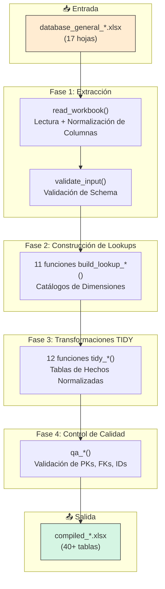
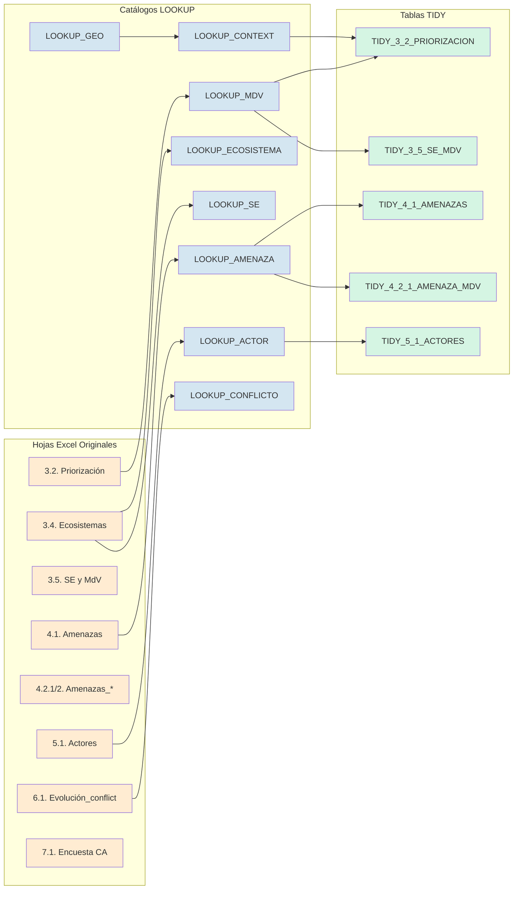

# Auditoría del Converter: Transformación de Excel a Tablas TIDY

Este documento proporciona una **auditoría detallada y neutral** del proceso de conversión implementado en `converter.py`. Explica cómo los datos brutos de Excel se transforman en tablas normalizadas (LOOKUP_* y TIDY_*) listas para el análisis.

---

## Visión General del Pipeline

El converter sigue un patrón **ETL (Extract-Transform-Load)** en tres fases principales:



---

## Fase 1: Extracción y Validación

### 1.1 Lectura del Archivo (`read_workbook`)

**Ubicación:** Línea 519-533

**Propósito:** Lee el archivo Excel y normaliza los nombres de columnas.

**Proceso:**
1. Abre el archivo con `openpyxl`
2. Para cada hoja en `SHEETS` (lista de 17 hojas esperadas):
   - Lee los datos como `object` (sin inferencia de tipos)
   - Elimina columnas duplicadas (mantiene la primera)
   - Aplica `normalize_columns()` para corregir nombres de columnas

**Columnas Requeridas por Hoja:**

| Hoja | Columnas Clave |
|:-----|:---------------|
| `3.1. Lluvia MdV&SE` | fecha, admin0, paisaje, grupo, elemento_SES, nombre, uso_fin_mdv |
| `3.2. Priorización` | fecha, admin0, paisaje, grupo, mdv, i_seg_alim, i_area, i_des_loc, i_ambiente, i_inclusion, i_total |
| `3.4. Ecosistemas` | fecha, admin0, paisaje, grupo, ecosistema, tipo, mdv_relacionado, es_salud, servicio_ecosistemico, causas_deg, cod_es |
| `3.5. SE y MdV` | fecha, admin0, paisaje, grupo, cod_es_se, mdv_relacionado, elemento_se, acceso, barreras, nr_usuarios, mes_contrib, mes_falta, inclusion |
| `4.1. Amenazas` | fecha, admin0, paisaje, grupo, tipo_amenaza, amenaza, magnitud, frequencia, tendencia, suma |
| `4.2.1. Amenazas_MdV` | amenaza, mdv, i_economia...i_politica, nr_familias, i_diferenciado, tipo_conflicto, nivel_conflicto, mapeo_conflicto |
| `4.2.2. Amenazas_SE` | amenaza, cod_se, i_economia...i_politica, i_diferenciado, mapeo_conflicto |
| `5.1. Actores` | nombre_actor, tipo_actor, rol_paisaje, conflicto_con, colabor_con, poder, interes |
| `5.2. Diálogo` | nombre_espacio, tipo, alcance, actores_invol, funcion, incidencia |
| `6.1. Evolución_conflict` | cod_conflict, evento, ano_evento, diferencias, dif_factor, cooperacion, coop_factor, suma |
| `6.2. Actores_conflict` | cod_conflict, actor, i_en_actor, iea_factor, i_en_conflicto |
| `7.1. Encuesta CA` | m_d_v, Dimension, grupo_indicador, average_valor |

### 1.2 Normalización de Columnas (`normalize_columns`)

**Ubicación:** Línea 478-517

**Propósito:** Corrige variantes comunes de nombres de columnas.

**Transformaciones:**

| Nombre Original | Nombre Normalizado | Razón |
|:----------------|:-------------------|:------|
| `medio_de_vida` | `mdv` | Abreviatura estándar |
| `interés` | `interes` | Sin acento |
| `indice_seguridad_alimentaria` | `i_seg_alim` | Abreviatura |
| `uso_fin_medio_de_vida` | `uso_fin_mdv` | Abreviatura |
| `medio_de_vida_relacionado` | `mdv_relacionado` | Abreviatura |

---

### 1.3 Hoja "variables": Metadatos de Referencia

**Propósito:** La hoja "variables" contiene **documentación de referencia** sobre las herramientas y variables utilizadas en el proceso de recolección de datos PARES.

**Columna Requerida:** `Herramienta/variable`

**Procesamiento en el Converter:**
1. Se **lee** como parte de `read_workbook()`
2. Se **valida** que exista la columna `Herramienta/variable`
3. Se **copia tal cual** a la salida cuando `copy_raw=True`
4. **NO se transforma** en una tabla TIDY normalizada

**Uso Posterior:**
> [!IMPORTANT]
> La hoja "variables" **no se utiliza** en ninguno de los pipelines de análisis (Storylines 1-5). 
> 
> Su propósito es puramente **documental**: sirve como diccionario de referencia para que los usuarios entiendan qué herramientas de recolección de datos se utilizaron y qué variables capturan.

**Contenido Típico:**
- Nombres de herramientas participativas (ej: "Priorización de MdV", "Mapeo de Actores")
- Variables capturadas por cada herramienta
- Descripciones metodológicas

Esta hoja es útil para:
- **Auditabilidad:** Permite rastrear qué metodología generó cada dato
- **Documentación:** Sirve como glosario para nuevos usuarios
- **Reproducibilidad:** Documenta el proceso de recolección

---

### 1.4 Validación de Schema (`validate_input`)

**Ubicación:** Línea 551-566

**Propósito:** Verifica que todas las hojas y columnas requeridas estén presentes.

**Salida:** Tabla QA indicando estado de cada hoja:
- `ok`: Hoja presente con todas las columnas
- `missing_sheet`: Hoja no existe
- `missing_columns`: Hoja existe pero faltan columnas

---

## Fase 2: Construcción de Lookups (Catálogos)

Los **lookups** son tablas de dimensión que contienen los catálogos maestros de entidades. Cada entidad recibe un **ID determinístico** generado mediante SHA-1 hash.

### 2.1 Generación de IDs Determinísticos

**Función:** `sha1_short(*parts, n=16)`

**Propósito:** Genera un ID único de 16 caracteres basado en el contenido.

```python
# Ejemplo:
sha1_short("mdv", "Ganadería bovina")
# -> "3f8a2b4c5d6e7f8g"
```

**Ventajas:**
- **Determinístico:** El mismo valor siempre produce el mismo ID
- **Sin colisiones:** SHA-1 garantiza unicidad práctica
- **Portable:** Los IDs son estables entre conversiones

### 2.2 Funciones de Lookup

#### `build_lookup_geo_context` → `LOOKUP_GEO`, `LOOKUP_CONTEXT`

**Ubicación:** Línea 573-594

**Propósito:** Construye la espina dorsal geográfica y temporal.

**Fuentes:** Todas las hojas que contengan `fecha`, `admin0`, `paisaje`, `grupo`

**Proceso:**
1. Extrae combinaciones únicas de (admin0, paisaje, grupo)
2. Genera `geo_id` = sha1(admin0, paisaje, grupo)
3. Genera `context_id` = sha1(geo_id, fecha_iso)

**Salida:**

| LOOKUP_GEO | LOOKUP_CONTEXT |
|:-----------|:---------------|
| geo_id | context_id |
| admin0 | geo_id |
| paisaje | fecha_iso |
| grupo | |

---

#### `build_lookup_mdv` → `LOOKUP_MDV`

**Ubicación:** Línea 666-713

**Propósito:** Catálogo maestro de Medios de Vida.

**Fuentes:**
- `3.1. Lluvia MdV&SE` → columna `nombre` donde `elemento_SES` contiene "medio"
- `3.2. Priorización` → columna `mdv` o `mdv `
- `3.3. Car_*` → columna `mdv`
- `3.4. Ecosistemas` → columna `mdv_relacionado` (splitea listas)
- `3.5. SE y MdV` → columna `mdv_relacionado` (splitea listas)
- `4.2.1. Amenazas_MdV` → columna `mdv` (splitea listas)
- `7.1. Encuesta CA` → columna `Medio de vida`

**Proceso:**
1. Recolecta todos los nombres de MdV de todas las fuentes
2. Limpia y deduplica usando `canonical_text()` (normaliza mayúsculas, espacios, acentos)
3. Genera `mdv_id` = sha1("mdv", nombre)

**Salida:**

| mdv_id | mdv_name |
|:-------|:---------|
| 3f8a2b... | Ganadería bovina |
| 7c9d4e... | Pesca artesanal |

---

#### `build_lookup_ecosistema` → `LOOKUP_ECOSISTEMA`

**Ubicación:** Línea 715-739

**Fuentes:**
- `3.1. Lluvia MdV&SE` → `nombre` donde `elemento_SES` contiene "ecosistema"
- `3.4. Ecosistemas` → columnas `cod_es`, `ecosistema`

**Lógica de ID:** Si existe `cod_es`, usa `sha1("eco", cod_es)`. Si no, usa `sha1("eco", ecosistema)`.

---

#### `build_lookup_se` → `LOOKUP_SE`

**Ubicación:** Línea 741-778

**Fuentes:**
- `3.4. Ecosistemas` → `servicio_ecosistemico` (splitea listas como "P1, P2")
- `3.5. SE y MdV` → `cod_es_se` (extrae parte después de "_", ej: "BM_P1" → "P1")
- `4.2.2. Amenazas_SE` → `cod_se`

---

#### `build_lookup_amenaza` → `LOOKUP_AMENAZA`

**Ubicación:** Línea 798-807

**Fuentes:** `4.1. Amenazas`, `4.2.1. Amenazas_MdV`, `4.2.2. Amenazas_SE`

**ID:** `sha1("amenaza", tipo_amenaza, amenaza)`

---

#### `build_lookup_actor` → `LOOKUP_ACTOR`

**Ubicación:** Línea 809-838

**Fuentes:**
- `5.1. Actores` → `nombre_actor`, `colabor_con`, `conflicto_con` (splitea listas)
- `5.2. Diálogo` → `actores_invol` (splitea listas)
- `6.2. Actores_conflict` → `actor`

---

#### `build_lookup_conflicto` → `LOOKUP_CONFLICTO`

**Ubicación:** Línea 851-885

**Fuentes:**
- `6.1. Evolución_conflict` → `cod_conflict`
- `6.2. Actores_conflict` → `cod_conflict`
- `4.2.1. Amenazas_MdV` → `mapeo_conflicto` (tokeniza por "_", espacio, ",", ";")
- `4.2.2. Amenazas_SE` → `mapeo_conflicto`

**Nota Importante:** La columna `mapeo_conflicto` puede contener múltiples códigos separados por delimitadores. El converter los tokeniza y los incluye en el catálogo de conflictos.

---

#### `build_lookup_ca_questions` → `LOOKUP_CA_QUESTIONS`

**Ubicación:** Línea 887-926

**Fuentes:** `7.1. Encuesta CA`

**Formatos Reconocidos:**
1. **Formato Agregado:** Preguntas en columna `grupo_indicador`
2. **Formato Crudo:** Preguntas como nombres de columnas (excepto País, Grupo, Medio de vida, Tamaño de propiedad)

**Extracción de Orden:** Si el nombre de pregunta comienza con número (ej: "1. ¿Tiene acceso a...?"), extrae el orden.

---

## Fase 3: Transformaciones TIDY

Las funciones `tidy_*` transforman las hojas crudas en tablas normalizadas, **adjuntando IDs de los lookups**.

### 3.1 Patrón General de Transformación

```python
def tidy_X(raw, geo, ctx, *lookups):
    # 1. Verificar que la hoja exista
    if sheet not in raw:
        return empty_dataframe
    
    # 2. Adjuntar context_id
    df = attach_context_id(raw[sheet], context_map)
    
    # 3. Mapear IDs desde lookups
    df["mdv_id"] = df["mdv_name"].map(mdv_id_map)
    
    # 4. Convertir tipos numéricos
    df["score"] = pd.to_numeric(df["score"], errors="coerce")
    
    # 5. Generar ID único de registro
    df["record_id"] = df.apply(lambda r: sha1_short("prefix", r["context_id"], r["mdv_id"]), axis=1)
    
    return df[output_columns]
```

### 3.2 Resumen de Transformaciones TIDY

| Función | Hoja Fuente | Tabla(s) de Salida | Columnas Clave |
|:--------|:------------|:-------------------|:---------------|
| `tidy_3_1_brainstorm` | 3.1. Lluvia MdV&SE | `TIDY_3_1_BRAINSTORM` | brainstorm_id, context_id, mdv_id, ecosistema_id |
| `tidy_3_2_priorizacion` | 3.2. Priorización | `TIDY_3_2_PRIORIZACION` | priorizacion_id, context_id, mdv_id, i_total |
| `tidy_3_3_car` | 3.3. Car_A/B/C/D | `TIDY_3_3_CAR_A/B/C/D`, `TIDY_3_3_CAR_LONG` | car_*_id, context_id, mdv_id |
| `tidy_3_4_ecosistemas` | 3.4. Ecosistemas | `TIDY_3_4_ECOSISTEMAS`, `TIDY_3_4_ECO_SE`, `TIDY_3_4_ECO_MDV` | ecosistema_obs_id, ecosistema_id, se_id, mdv_id |
| `tidy_3_5_se_mdv` | 3.5. SE y MdV | `TIDY_3_5_SE_MDV`, `TIDY_3_5_MONTHS`, `TIDY_3_5_INCLUSION` | se_mdv_id, ecosistema_id, se_id, mdv_id |
| `tidy_4_1_amenazas` | 4.1. Amenazas | `TIDY_4_1_AMENAZAS` | amenaza_obs_id, context_id, amenaza_id, suma |
| `tidy_4_2_amenaza_mdv` | 4.2.1. Amenazas_MdV | `TIDY_4_2_1_AMENAZA_MDV`, `TIDY_4_2_1_DIFERENCIADO`, `TIDY_4_2_1_MAPEO_CONFLICTO` | amenaza_mdv_id, amenaza_id, mdv_id |
| `tidy_4_2_amenaza_se` | 4.2.2. Amenazas_SE | `TIDY_4_2_2_AMENAZA_SE`, `TIDY_4_2_2_DIFERENCIADO`, `TIDY_4_2_2_MAPEO_CONFLICTO` | amenaza_se_id, amenaza_id, se_id |
| `tidy_5_1_actores` | 5.1. Actores | `TIDY_5_1_ACTORES`, `TIDY_5_1_RELACIONES` | actor_obs_id, actor_id (principal, colabora, conflicto) |
| `tidy_5_2_dialogo` | 5.2. Diálogo | `TIDY_5_2_DIALOGO`, `TIDY_5_2_DIALOGO_ACTOR` | dialogo_id, espacio_id, actor_id |
| `tidy_6_1_conflict_events` | 6.1. Evolución_conflict | `TIDY_6_1_CONFLICT_EVENTS` | conflict_event_id, context_id, conflicto_id, ano_evento |
| `tidy_6_2_conflict_actor` | 6.2. Actores_conflict | `TIDY_6_2_CONFLICT_ACTOR` | conflict_actor_id, conflicto_id, actor_id |
| `tidy_7_1_ca` | 7.1. Encuesta CA | `TIDY_7_1_RESPONDENTS`, `TIDY_7_1_RESPONSES` | respondent_id, mdv_id, question_id, response_numeric |

### 3.3 Manejo de Listas Multi-valor

**Función:** `split_list(value)` y `explode_list_column(df, col, out_col)`

**Propósito:** Muchas celdas contienen listas separadas por coma, punto y coma o salto de línea.

**Ejemplo:**
```
Celda original: "Pesca artesanal, Ganadería, Agricultura"

Después de explosión:
| mdv_name |
|----------|
| Pesca artesanal |
| Ganadería |
| Agricultura |
```

**Columnas que usan explosión:**
- `mdv` en 4.2.1 y 3.5
- `servicio_ecosistemico` en 3.4
- `mdv_relacionado` en 3.4 y 3.5
- `actores_invol` en 5.2
- `colabor_con` y `conflicto_con` en 5.1
- `i_diferenciado` en 4.2.1 y 4.2.2

---

## Fase 4: Control de Calidad (QA)

### 4.1 Funciones QA

| Función | Propósito | Salida |
|:--------|:----------|:-------|
| `qa_table_summary` | Resumen de todas las tablas | Nombre, filas, columnas |
| `qa_pk_duplicates` | Detecta claves primarias duplicadas | Tabla, PK, conteo duplicados |
| `qa_missing_ids` | Detecta IDs faltantes o vacíos | Tabla, columna, conteo nulos |
| `qa_fk` | Valida integridad referencial | Tabla, FK, lookup, FKs huérfanas |

### 4.2 Validaciones de FK

El compiler valida las siguientes relaciones:

```
TIDY_3_2_PRIORIZACION.mdv_id → LOOKUP_MDV.mdv_id
TIDY_4_1_AMENAZAS.amenaza_id → LOOKUP_AMENAZA.amenaza_id
TIDY_4_2_1_AMENAZA_MDV.mdv_id → LOOKUP_MDV.mdv_id
TIDY_5_1_ACTORES.actor_id → LOOKUP_ACTOR.actor_id
...
```

---

## Función Principal: `compile_workbook`

**Ubicación:** Línea 1664-1883

**Flujo de Orquestación:**

```python
def compile_workbook(input_path, strict=True, copy_raw=True):
    # 1. LECTURA
    raw = read_workbook(input_path)
    qa_schema = validate_input(raw, strict=strict)

    # 2. LOOKUPS (11 catálogos)
    geo, ctx = build_lookup_geo_context(raw)
    survey_ctx = build_lookup_survey_context(raw)
    mdv = build_lookup_mdv(raw)
    eco = build_lookup_ecosistema(raw)
    se  = build_lookup_se(raw)
    elemento_se = build_lookup_elemento_se(raw)
    amen = build_lookup_amenaza(raw)
    actor = build_lookup_actor(raw)
    espacio = build_lookup_espacio(raw)
    conflicto = build_lookup_conflicto(raw)
    ca_q = build_lookup_ca_questions(raw)

    # 3. TIDY TRANSFORMS (12 transformaciones → 24+ tablas)
    t31 = tidy_3_1_brainstorm(raw, geo, ctx, mdv, eco)
    t32 = tidy_3_2_priorizacion(raw, geo, ctx, mdv)
    ... # demás transformaciones

    # 4. ENSAMBLAJE DE SALIDA
    tables = {}
    if copy_raw:
        for sh, df in raw.items():
            tables[sh] = df  # Copiar hojas originales
    
    # Agregar lookups
    tables["LOOKUP_GEO"] = geo
    tables["LOOKUP_CONTEXT"] = ctx
    ... 
    
    # Agregar tidy tables
    tables["TIDY_3_1_BRAINSTORM"] = t31
    tables["TIDY_3_2_PRIORIZACION"] = t32
    ...
    
    # 5. QA
    tables["QA_SCHEMA"] = qa_schema
    tables["QA_TABLE_SUMMARY"] = qa_table_summary(tables)
    tables["QA_PK_DUPLICATES"] = qa_pk_duplicates(tables, pk_map)
    tables["QA_MISSING_IDS"] = qa_missing_ids(tables, id_cols)
    tables["QA_FK"] = qa_fk(tables, fk_specs)
    
    return tables
```

---

## Diagramas de Conexión

### Conexión Excel → LOOKUP → TIDY



---

## Notas Importantes para Usuarios

### 1. IDs Determinísticos

Los IDs generados son **estables**: el mismo dato siempre produce el mismo ID. Esto permite:
- Comparar versiones de archivos
- Hacer joins entre diferentes conversiones
- Trackear cambios en entidades específicas

### 2. Precedencia de Códigos

Cuando existe tanto `cod_*` (código corto) como nombre completo, el converter prefiere el código para generar IDs. Esto hace los IDs más estables si los nombres cambian.

### 3. Listas Multi-valor

Celdas con múltiples valores separados por `,`, `;` o salto de línea se **explotan** en múltiples filas. Esto normaliza los datos pero puede aumentar significativamente el número de registros.

### 4. Tolerancia a Errores

El converter es tolerante:
- Si una hoja no existe, genera tabla vacía con esquema correcto
- Si una columna no existe, usa `np.nan`
- Si un ID no se puede mapear, deja `np.nan` (no falla)

### 5. Diagnóstico Pre-Conversión

La función `diagnose_file(path)` puede ejecutarse antes de la conversión para detectar problemas comunes:
- Hojas faltantes
- Columnas faltantes
- Nombres de columnas incorrectos (mayúsculas, acentos, typos)
- Encabezados corruptos (fechas en lugar de nombres de columna)

---

## Referencia Rápida: Salidas del Compiler

| Categoría | Tablas |
|:----------|:-------|
| **LOOKUP** | LOOKUP_GEO, LOOKUP_CONTEXT, LOOKUP_SURVEY_CONTEXT, LOOKUP_MDV, LOOKUP_ECOSISTEMA, LOOKUP_SE, LOOKUP_ELEMENTO_SE, LOOKUP_AMENAZA, LOOKUP_ACTOR, LOOKUP_ESPACIO, LOOKUP_CONFLICTO, LOOKUP_CA_QUESTIONS |
| **TIDY Contexto** | TIDY_3_1_BRAINSTORM, TIDY_3_2_PRIORIZACION |
| **TIDY Caracterización** | TIDY_3_3_CAR_A/B/C/D, TIDY_3_3_CAR_LONG |
| **TIDY Ecosistemas** | TIDY_3_4_ECOSISTEMAS, TIDY_3_4_ECO_SE, TIDY_3_4_ECO_MDV |
| **TIDY SE-MdV** | TIDY_3_5_SE_MDV, TIDY_3_5_MONTHS, TIDY_3_5_INCLUSION |
| **TIDY Amenazas** | TIDY_4_1_AMENAZAS, TIDY_4_2_1_AMENAZA_MDV, TIDY_4_2_1_DIFERENCIADO, TIDY_4_2_1_MAPEO_CONFLICTO, TIDY_4_2_2_AMENAZA_SE, TIDY_4_2_2_DIFERENCIADO, TIDY_4_2_2_MAPEO_CONFLICTO |
| **TIDY Actores** | TIDY_5_1_ACTORES, TIDY_5_1_RELACIONES, TIDY_5_2_DIALOGO, TIDY_5_2_DIALOGO_ACTOR |
| **TIDY Conflicto** | TIDY_6_1_CONFLICT_EVENTS, TIDY_6_2_CONFLICT_ACTOR |
| **TIDY Encuesta** | TIDY_7_1_RESPONDENTS, TIDY_7_1_RESPONSES |
| **QA** | QA_SCHEMA, QA_TABLE_SUMMARY, QA_PK_DUPLICATES, QA_MISSING_IDS, QA_FK |
