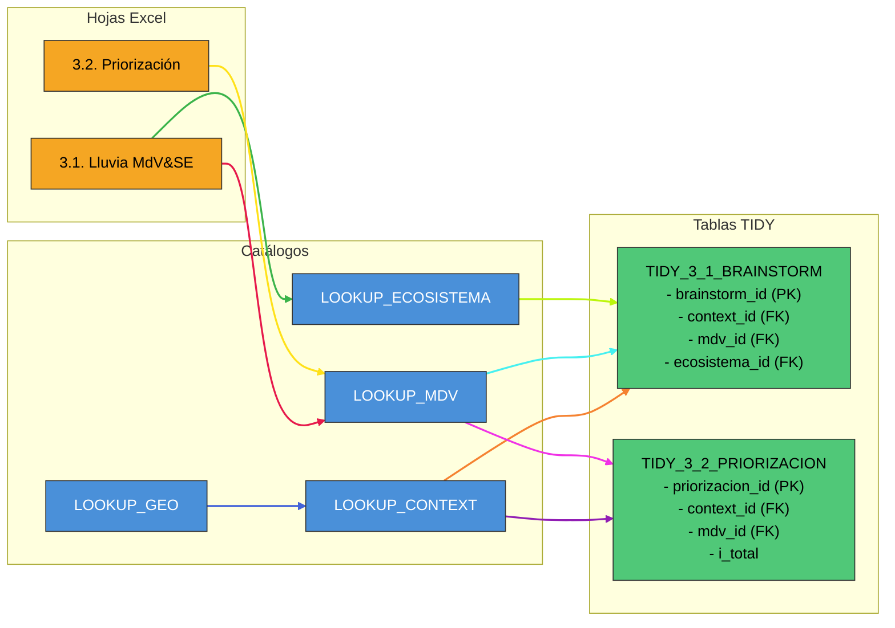
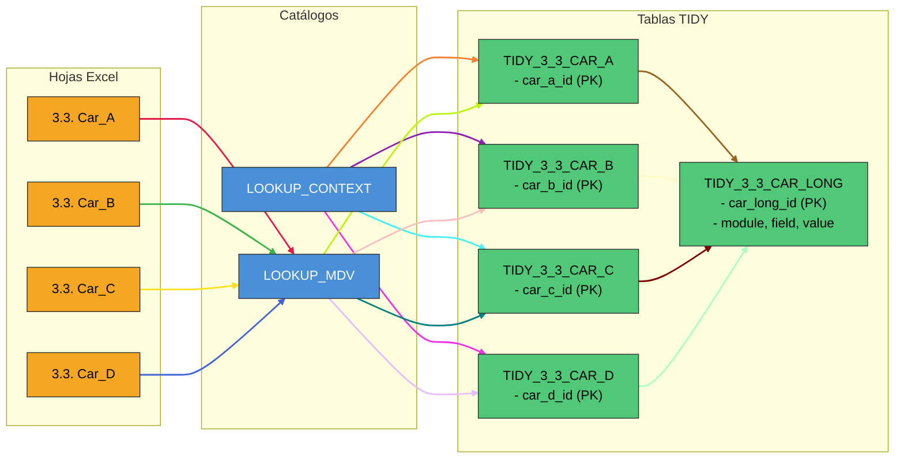
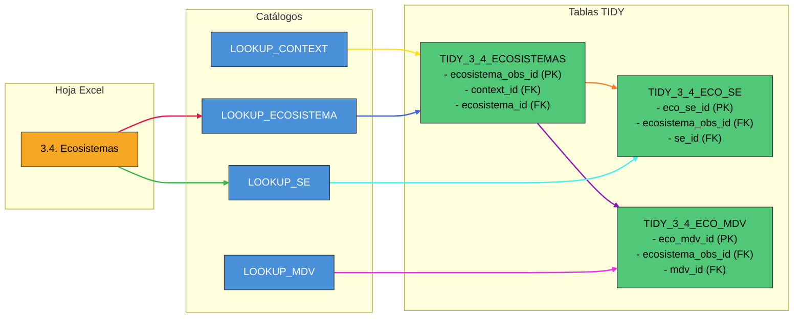
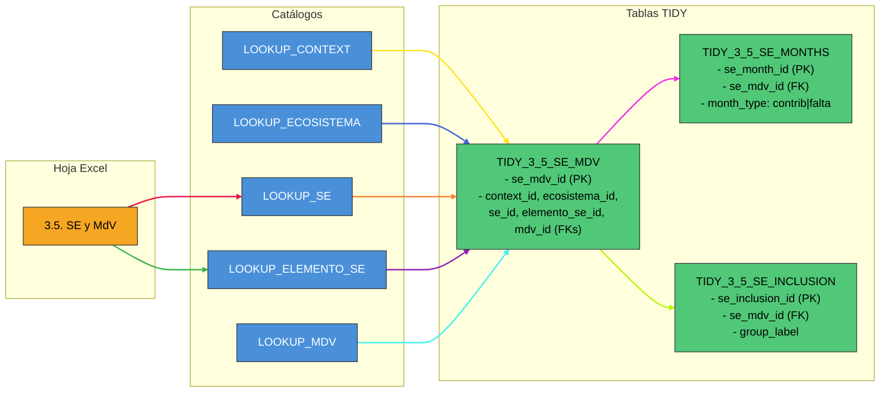
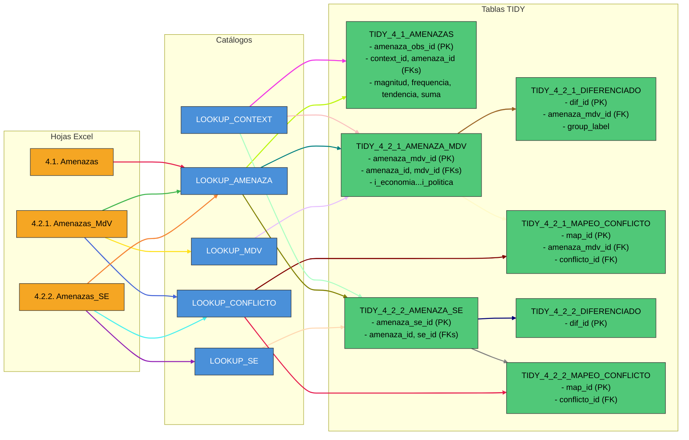
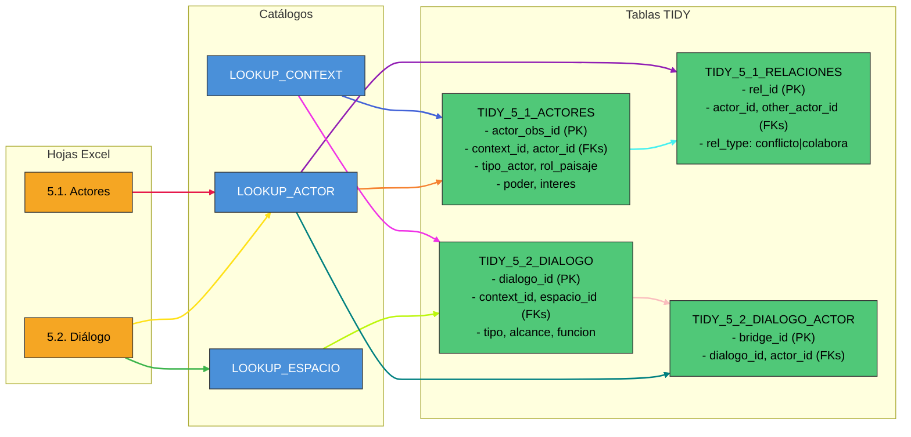
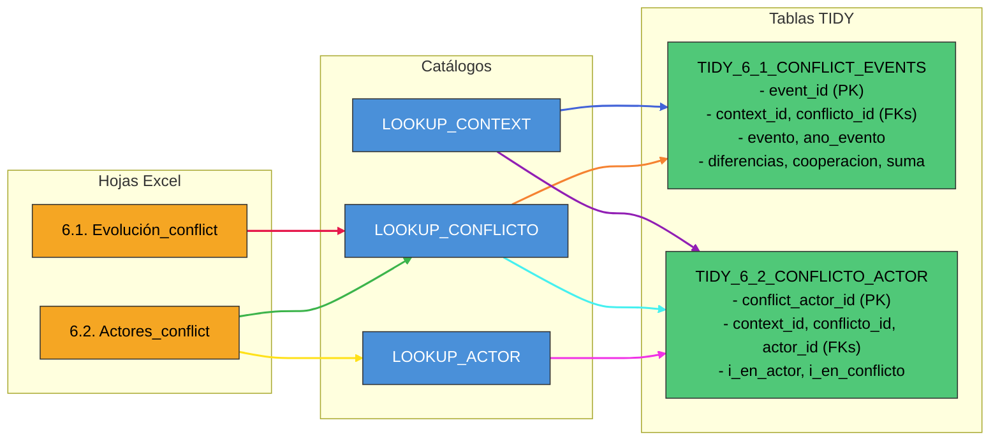
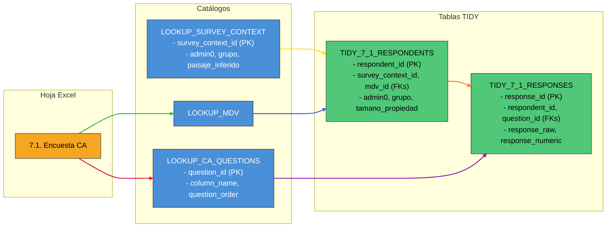
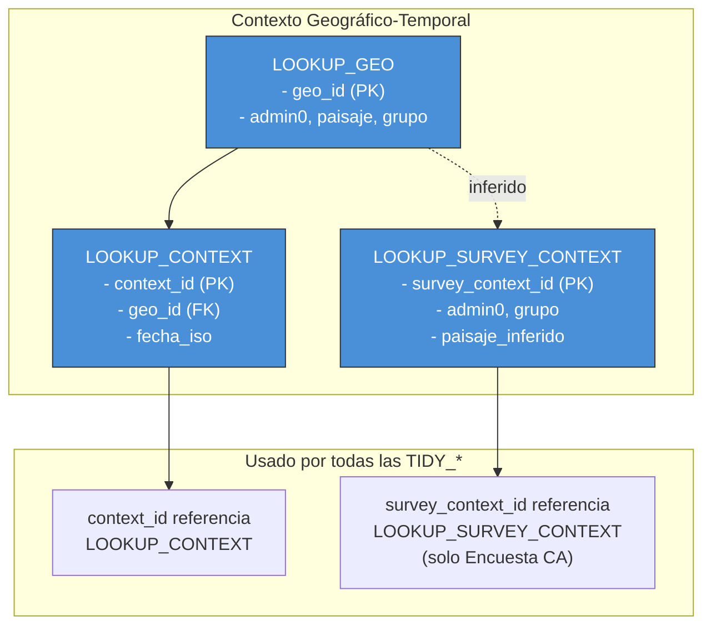

# Diagramas del Converter PARES

Este archivo contiene todos los diagramas de flujo de datos del converter, organizados por módulo y en versión completa.

---

> [!TIP]
> **Navegación por Colores**: En el Diagrama Completo y en los módulos, cada flecha tiene un color único. Esto permite seguir el rastro exacto desde la hoja Excel original, pasando por los catálogos, hasta la tabla TIDY final.

---

## Diagrama Completo: Todas las Tablas

```mermaid
graph LR
    subgraph EXCEL["📥 Hojas Excel Originales"]
        E31["3.1. Lluvia MdV&SE"]
        E32["3.2. Priorización"]
        E33["3.3. Car_A/B/C/D"]
        E34["3.4. Ecosistemas"]
        E35["3.5. SE y MdV"]
        E41["4.1. Amenazas"]
        E421["4.2.1. Amenazas_MdV"]
        E422["4.2.2. Amenazas_SE"]
        E51["5.1. Actores"]
        E52["5.2. Diálogo"]
        E61["6.1. Evolución_conflict"]
        E62["6.2. Actores_conflict"]
        E71["7.1. Encuesta CA"]
    end

    subgraph LOOKUPS["📚 Catálogos LOOKUP"]
        LG["LOOKUP_GEO"]
        LC["LOOKUP_CONTEXT"]
        LSC["LOOKUP_SURVEY_CONTEXT"]
        LM["LOOKUP_MDV"]
        LE["LOOKUP_ECOSISTEMA"]
        LS["LOOKUP_SE"]
        LSE["LOOKUP_ELEMENTO_SE"]
        LA["LOOKUP_AMENAZA"]
        LAC["LOOKUP_ACTOR"]
        LEP["LOOKUP_ESPACIO"]
        LCO["LOOKUP_CONFLICTO"]
        LCA["LOOKUP_CA_QUESTIONS"]
    end

    subgraph TIDY["📊 Tablas TIDY"]
        T31["TIDY_3_1_BRAINSTORM"]
        T32["TIDY_3_2_PRIORIZACION"]
        T33A["TIDY_3_3_CAR_A"]
        T33B["TIDY_3_3_CAR_B"]
        T33C["TIDY_3_3_CAR_C"]
        T33D["TIDY_3_3_CAR_D"]
        T33L["TIDY_3_3_CAR_LONG"]
        T34M["TIDY_3_4_ECOSISTEMAS"]
        T34SE["TIDY_3_4_ECO_SE"]
        T34MDV["TIDY_3_4_ECO_MDV"]
        T35M["TIDY_3_5_SE_MDV"]
        T35MO["TIDY_3_5_SE_MONTHS"]
        T35IN["TIDY_3_5_SE_INCLUSION"]
        T41["TIDY_4_1_AMENAZAS"]
        T421M["TIDY_4_2_1_AMENAZA_MDV"]
        T421D["TIDY_4_2_1_DIFERENCIADO"]
        T421C["TIDY_4_2_1_MAPEO_CONFLICTO"]
        T422M["TIDY_4_2_2_AMENAZA_SE"]
        T422D["TIDY_4_2_2_DIFERENCIADO"]
        T422C["TIDY_4_2_2_MAPEO_CONFLICTO"]
        T51M["TIDY_5_1_ACTORES"]
        T51R["TIDY_5_1_RELACIONES"]
        T52M["TIDY_5_2_DIALOGO"]
        T52A["TIDY_5_2_DIALOGO_ACTOR"]
        T61["TIDY_6_1_CONFLICT_EVENTS"]
        T62["TIDY_6_2_CONFLICTO_ACTOR"]
        T71R["TIDY_7_1_RESPONDENTS"]
        T71A["TIDY_7_1_RESPONSES"]
    end

    %% Excel -> Lookups
    E31 --> LM
    E31 --> LE
    E32 --> LM
    E33 --> LM
    E34 --> LE
    E34 --> LS
    E35 --> LS
    E35 --> LSE
    E41 --> LA
    E421 --> LA
    E422 --> LA
    E51 --> LAC
    E52 --> LEP
    E52 --> LAC
    E61 --> LCO
    E62 --> LCO
    E62 --> LAC
    E71 --> LCA
    E71 --> LM

    %% Lookups -> Tidy
    LC --> T31
    LC --> T32
    LC --> T33A
    LC --> T34M
    LC --> T35M
    LC --> T41
    LC --> T421M
    LC --> T422M
    LC --> T51M
    LC --> T52M
    LC --> T61
    LC --> T62

    LM --> T31
    LM --> T32
    LM --> T33A
    LM --> T34MDV
    LM --> T35M
    LM --> T421M
    LM --> T71R

    LE --> T31
    LE --> T34M
    LE --> T35M

    LS --> T34SE
    LS --> T35M
    LS --> T422M

    LSE --> T35M

    LA --> T41
    LA --> T421M
    LA --> T422M

    LAC --> T51M
    LAC --> T51R
    LAC --> T52A
    LAC --> T62

    LEP --> T52M

    LCO --> T421C
    LCO --> T422C
    LCO --> T61
    LCO --> T62

    LSC --> T71R
    LCA --> T71A

    classDef excel fill:#f5a623,stroke:#333,color:#000
    classDef lookup fill:#4a90d9,stroke:#333,color:#fff
    classDef tidy fill:#50c878,stroke:#333,color:#000

    class E31,E32,E33,E34,E35,E41,E421,E422,E51,E52,E61,E62,E71 excel
    class LG,LC,LSC,LM,LE,LS,LSE,LA,LAC,LEP,LCO,LCA lookup
    class T31,T32,T33A,T33B,T33C,T33D,T33L,T34M,T34SE,T34MDV,T35M,T35MO,T35IN,T41,T421M,T421D,T421C,T422M,T422D,T422C,T51M,T51R,T52M,T52A,T61,T62,T71R,T71A tidy

    linkStyle 0 stroke:#e6194b,stroke-width:2px
    linkStyle 1 stroke:#3cb44b,stroke-width:2px
    linkStyle 2 stroke:#ffe119,stroke-width:2px
    linkStyle 3 stroke:#4363d8,stroke-width:2px
    linkStyle 4 stroke:#f58231,stroke-width:2px
    linkStyle 5 stroke:#911eb4,stroke-width:2px
    linkStyle 6 stroke:#46f0f0,stroke-width:2px
    linkStyle 7 stroke:#f032e6,stroke-width:2px
    linkStyle 8 stroke:#bcf60c,stroke-width:2px
    linkStyle 9 stroke:#fabebe,stroke-width:2px
    linkStyle 10 stroke:#008080,stroke-width:2px
    linkStyle 11 stroke:#e6beff,stroke-width:2px
    linkStyle 12 stroke:#9a6324,stroke-width:2px
    linkStyle 13 stroke:#fffac8,stroke-width:2px
    linkStyle 14 stroke:#800000,stroke-width:2px
    linkStyle 15 stroke:#aaffc3,stroke-width:2px
    linkStyle 16 stroke:#808000,stroke-width:2px
    linkStyle 17 stroke:#ffd8b1,stroke-width:2px
    linkStyle 18 stroke:#000075,stroke-width:2px
    linkStyle 19 stroke:#808080,stroke-width:2px
    linkStyle 20 stroke:#e6194b,stroke-width:2px
    linkStyle 21 stroke:#3cb44b,stroke-width:2px
    linkStyle 22 stroke:#ffe119,stroke-width:2px
    linkStyle 23 stroke:#4363d8,stroke-width:2px
    linkStyle 24 stroke:#f58231,stroke-width:2px
    linkStyle 25 stroke:#911eb4,stroke-width:2px
    linkStyle 26 stroke:#46f0f0,stroke-width:2px
    linkStyle 27 stroke:#f032e6,stroke-width:2px
    linkStyle 28 stroke:#bcf60c,stroke-width:2px
    linkStyle 29 stroke:#fabebe,stroke-width:2px
    linkStyle 30 stroke:#008080,stroke-width:2px
    linkStyle 31 stroke:#e6beff,stroke-width:2px
    linkStyle 32 stroke:#9a6324,stroke-width:2px
    linkStyle 33 stroke:#fffac8,stroke-width:2px
    linkStyle 34 stroke:#800000,stroke-width:2px
    linkStyle 35 stroke:#aaffc3,stroke-width:2px
    linkStyle 36 stroke:#808000,stroke-width:2px
    linkStyle 37 stroke:#ffd8b1,stroke-width:2px
    linkStyle 38 stroke:#000075,stroke-width:2px
    linkStyle 39 stroke:#808080,stroke-width:2px
    linkStyle 40 stroke:#e6194b,stroke-width:2px
    linkStyle 41 stroke:#3cb44b,stroke-width:2px
    linkStyle 42 stroke:#ffe119,stroke-width:2px
    linkStyle 43 stroke:#4363d8,stroke-width:2px
    linkStyle 44 stroke:#f58231,stroke-width:2px
    linkStyle 45 stroke:#911eb4,stroke-width:2px
    linkStyle 46 stroke:#46f0f0,stroke-width:2px
    linkStyle 47 stroke:#f032e6,stroke-width:2px
    linkStyle 48 stroke:#bcf60c,stroke-width:2px
    linkStyle 49 stroke:#fabebe,stroke-width:2px
    linkStyle 50 stroke:#008080,stroke-width:2px
    linkStyle 51 stroke:#e6beff,stroke-width:2px
    linkStyle 52 stroke:#9a6324,stroke-width:2px
    linkStyle 53 stroke:#fffac8,stroke-width:2px
    linkStyle 54 stroke:#800000,stroke-width:2px
    linkStyle 55 stroke:#aaffc3,stroke-width:2px
    linkStyle 56 stroke:#808000,stroke-width:2px
    linkStyle 57 stroke:#ffd8b1,stroke-width:2px
    linkStyle 58 stroke:#000075,stroke-width:2px
```

---

## Módulo 3.1-3.2: Medios de Vida y Priorización

---

## Módulo 3.3: Caracterización de MdV

---

## Módulo 3.4: Ecosistemas

---

## Módulo 3.5: Servicios Ecosistémicos y MdV

---

## Módulo 4: Amenazas

---

## Módulo 5: Actores y Diálogo

---

## Módulo 6: Evolución de Conflictos

---

## Módulo 7: Encuesta de Capacidades Adaptativas

---

## Diagrama de Jerarquía de Contexto

---

## Resumen de Tablas

### LOOKUPs (12 catálogos)

| Lookup                | PK                | Descripción                                    |
| :-------------------- | :---------------- | :--------------------------------------------- |
| LOOKUP_GEO            | geo_id            | Combinaciones únicas de admin0, paisaje, grupo |
| LOOKUP_CONTEXT        | context_id        | geo_id + fecha_iso                             |
| LOOKUP_SURVEY_CONTEXT | survey_context_id | Contexto específico para encuestas             |
| LOOKUP_MDV            | mdv_id            | Catálogo de Medios de Vida                     |
| LOOKUP_ECOSISTEMA     | ecosistema_id     | Catálogo de Ecosistemas                        |
| LOOKUP_SE             | se_id             | Catálogo de Servicios Ecosistémicos            |
| LOOKUP_ELEMENTO_SE    | elemento_se_id    | Elementos de SE (acceso, barreras, etc.)       |
| LOOKUP_AMENAZA        | amenaza_id        | Catálogo de Amenazas                           |
| LOOKUP_ACTOR          | actor_id          | Catálogo de Actores                            |
| LOOKUP_ESPACIO        | espacio_id        | Catálogo de Espacios de Diálogo                |
| LOOKUP_CONFLICTO      | conflicto_id      | Catálogo de Conflictos                         |
| LOOKUP_CA_QUESTIONS   | question_id       | Preguntas de la Encuesta CA                    |

### TIDYs (28 tablas)

| Tabla                      | PK                | FKs Principales                                          |
| :------------------------- | :---------------- | :------------------------------------------------------- |
| TIDY_3_1_BRAINSTORM        | brainstorm_id     | context_id, mdv_id, ecosistema_id                        |
| TIDY_3_2_PRIORIZACION      | priorizacion_id   | context_id, mdv_id                                       |
| TIDY_3_3_CAR_A/B/C/D       | car\_\*\_id       | context_id, mdv_id                                       |
| TIDY_3_3_CAR_LONG          | car_long_id       | record_id, context_id, mdv_id                            |
| TIDY_3_4_ECOSISTEMAS       | ecosistema_obs_id | context_id, ecosistema_id                                |
| TIDY_3_4_ECO_SE            | eco_se_id         | ecosistema_obs_id, se_id                                 |
| TIDY_3_4_ECO_MDV           | eco_mdv_id        | ecosistema_obs_id, mdv_id                                |
| TIDY_3_5_SE_MDV            | se_mdv_id         | context_id, ecosistema_id, se_id, elemento_se_id, mdv_id |
| TIDY_3_5_SE_MONTHS         | se_month_id       | se_mdv_id                                                |
| TIDY_3_5_SE_INCLUSION      | se_inclusion_id   | se_mdv_id                                                |
| TIDY_4_1_AMENAZAS          | amenaza_obs_id    | context_id, amenaza_id                                   |
| TIDY_4_2_1_AMENAZA_MDV     | amenaza_mdv_id    | context_id, amenaza_id, mdv_id                           |
| TIDY_4_2_1_DIFERENCIADO    | dif_id            | amenaza_mdv_id                                           |
| TIDY_4_2_1_MAPEO_CONFLICTO | map_id            | amenaza_mdv_id, conflicto_id                             |
| TIDY_4_2_2_AMENAZA_SE      | amenaza_se_id     | context_id, amenaza_id, se_id                            |
| TIDY_4_2_2_DIFERENCIADO    | dif_id            | amenaza_se_id                                            |
| TIDY_4_2_2_MAPEO_CONFLICTO | map_id            | amenaza_se_id, conflicto_id                              |
| TIDY_5_1_ACTORES           | actor_obs_id      | context_id, actor_id                                     |
| TIDY_5_1_RELACIONES        | rel_id            | context_id, actor_id, other_actor_id                     |
| TIDY_5_2_DIALOGO           | dialogo_id        | context_id, espacio_id                                   |
| TIDY_5_2_DIALOGO_ACTOR     | bridge_id         | dialogo_id, actor_id                                     |
| TIDY_6_1_CONFLICT_EVENTS   | event_id          | context_id, conflicto_id                                 |
| TIDY_6_2_CONFLICTO_ACTOR   | conflict_actor_id | context_id, conflicto_id, actor_id                       |
| TIDY_7_1_RESPONDENTS       | respondent_id     | survey_context_id, mdv_id                                |
| TIDY_7_1_RESPONSES         | response_id       | respondent_id, question_id                               |
