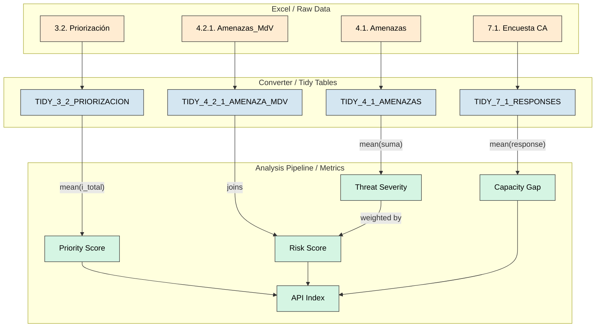
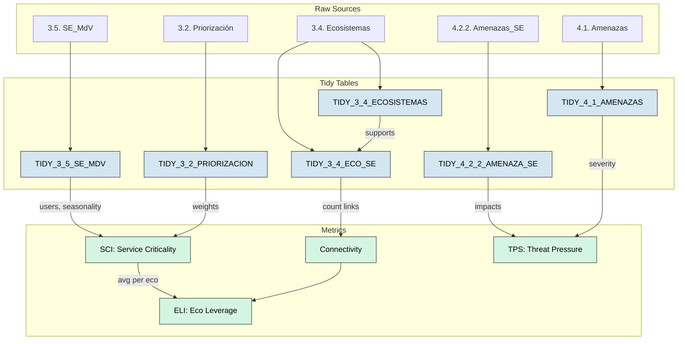
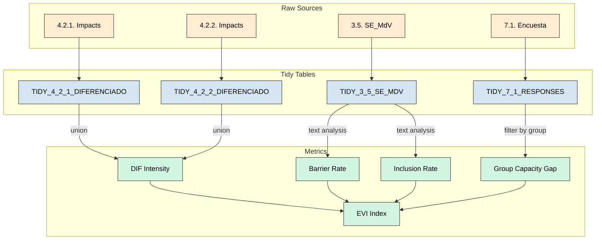
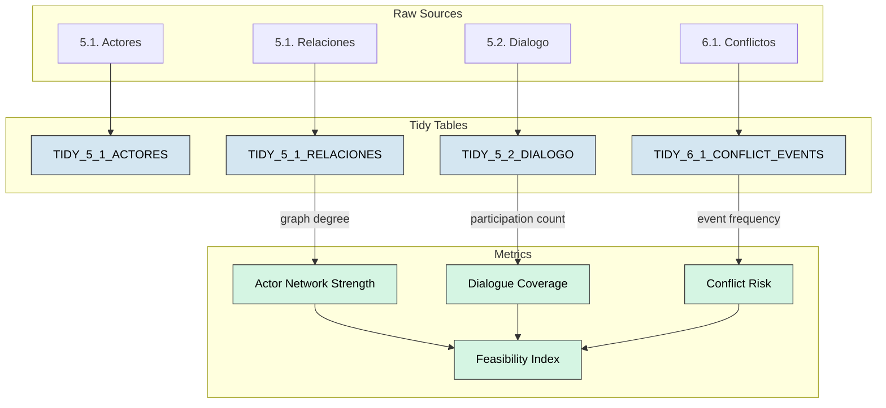
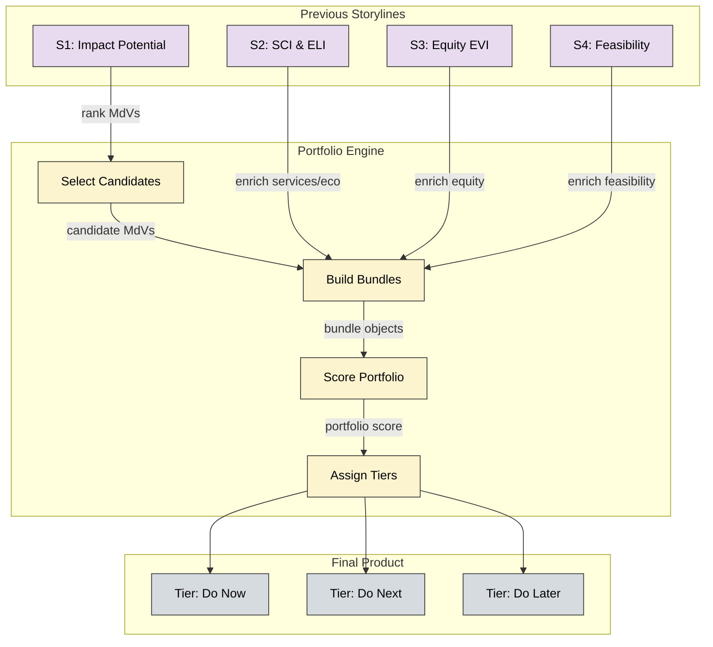

# Data Connections & Lineage Map

This document details the data "plumbing" for the **PARES Analysis Pipelines**. It maps how raw Excel sheets are transformed into analysis-ready tables and how those tables are joined to calculate key metrics.

## Storyline 1: Where to Act First? (Prioritization)

**Goal:** Identify which Livelihoods (Medios de Vida) are most critical, most at risk, and have the least adaptive capacity.
**Key Metric:** Action Priority Index (API) = Weighted Index of (Priority + Risk + Capacity Gap).

### 1. Data Source Traceability (Raw inputs)

| Raw Sheet (User Input) | Key Columns Extracted | Conversion Logic (Tidy) | Output Table (Analysis Ready) |
| :--- | :--- | :--- | :--- |
| **3.2. Priorización** | `País`, `Grupo`, `Medio de vida`, `Total` | Normalizes columns, links to Context & MdV IDs. | `TIDY_3_2_PRIORIZACION` |
| **4.1. Amenazas** | `País`, `Grupo`, `Amenaza`, `Suma` (Severity) | Extracts threat severity scores. | `TIDY_4_1_AMENAZAS` |
| **4.2.1. Amenazas_MdV** | `País`, `Grupo`, `Medio de vida`, `Amenaza`, Impact scores (`Pérdida`, etc.) | Links specific threats to specific MdVs. | `TIDY_4_2_1_AMENAZA_MDV` |
| **7.1. Encuesta CA** | `m_d_v` (or `Medio de vida`), Questions (Aggregated or Raw) | Processes survey responses into numeric scores (0-1). | `TIDY_7_1_RESPONSES`<br>`TIDY_7_1_RESPONDENTS` |
| **1.1. Contexto** | `País`, `Grupo`, `Paisaje` | Builds the Global ID spine. | `LOOKUP_CONTEXT`<br>`LOOKUP_GEO` |

### 2. Analysis Logic & Joins (The "Plumbing")

The analysis pipeline joins these tables to compute the final **API Score**.

#### Step A: Calculate Importance (Priority)
*   **Source:** `TIDY_3_2_PRIORIZACION`
*   **Logic:** Aggregates the `i_total` (Importance Total) by Livelihood (`mdv_id`).
*   **Metric:** `mean_i_total` -> Normalized to `priority_norm` (0-1).

#### Step B: Calculate Threat Severity
*   **Source:** `TIDY_4_1_AMENAZAS`
*   **Logic:** Aggregates `suma` (Severity Score) by Threat (`amenaza_id`).
*   **Metric:** `mean_suma` -> Normalized to `suma_norm` (0-1).

#### Step C: Calculate Risk (Impact * Severity)
*   **Source:** `TIDY_4_2_1_AMENAZA_MDV` **JOIN** `Step B (Threat Severity)`
*   **Join Key:** `amenaza_id`
*   **Logic:** 
    1.  Sum the Impact Dimensions (Loss, Quality, Access...) -> `impact_total`.
    2.  Multiply `impact_total` * `suma_norm` (Threat Severity) = `weighted_impact`.
    3.  Sum `weighted_impact` for all threats affecting a Livelihood.
*   **Metric:** `sum_weighted_impact` -> Normalized to `risk_norm` (0-1).

#### Step D: Calculate Adaptive Capacity
*   **Source:** `TIDY_7_1_RESPONSES` **JOIN** `TIDY_7_1_RESPONDENTS`
*   **Join Key:** `respondent_id`
*   **Logic:** 
    1.  Average the normalized response scores (0-1) per Livelihood (`mdv_id`).
    2.  `Capacity Gap` = 1 - `Average Capacity`.
*   **Metric:** `capacity_gap` -> Normalized to `cap_gap_norm` (0-1).

#### Step E: Final API Calculation
*   **Inputs:** `priority_norm`, `risk_norm`, `cap_gap_norm`
*   **Formula:** 
    ```python
    API = (w_priority * priority) + (w_risk * risk) + (w_capacity * capacity_gap)
    ```
    *(Weights vary by scenario, e.g., Balanced, Risk-First)*
*   **Output:** Ranked list of Livelihoods requiring intervention.

### 3. Visual Connection Map (Mermaid)



## Storyline 2: Ecosystem-Service Lifelines

**Goal:** Understand the "Lifelines" connecting Ecosystems -> Services -> Livelihoods.
**Key Metrics:** 
*   **SCI (Service Criticality Index):** How vital a service is to the community.
*   **ELI (Ecosystem Leverage Index):** How strategically important an ecosystem is (supporting critical services).
*   **TPS (Threat Pressure on Services):** Vulnerability of services to threats.

### 1. Data Source Traceability

| Raw Sheet | Key Columns | Conversion Logic | Output Table |
| :--- | :--- | :--- | :--- |
| **3.4. Ecosistemas** | `Ecosistema`, `Causas degradación` | Normalizes ecosystem names/IDs. | `TIDY_3_4_ECOSISTEMAS` |
| **3.4. Eco_SE** | `Ecosistema`, `Servicio Ecosistémico` | Maps ecosystems to the services they provide. | `TIDY_3_4_ECO_SE` |
| **3.5. SE_MdV** | `Servicio`, `MdV`, `Usuarios`, `Mes falta` | Maps services to livelihood dependence + seasonality. | `TIDY_3_5_SE_MDV` |
| **3.2. Priorización** | `MdV`, `Total` (Importance) | Used to weight the importance of livelihoods dependent on services. | `TIDY_3_2_PRIORIZACION` |
| **4.2.2. Amenazas_SE** | `Amenaza`, `Servicio`, `Impacto` | Maps threats impacting specific services. | `TIDY_4_2_2_AMENAZA_SE` |
| **4.1. Amenazas** | `Amenaza`, `Suma` | Threat severity weights. | `TIDY_4_1_AMENAZAS` |

### 2. Analysis Logic & Joins

#### Step A: Ecosystem Connectivity
*   **Sources:** `TIDY_3_4_ECOSISTEMAS` **LEFT JOIN** `TIDY_3_4_ECO_SE` **LEFT JOIN** `TIDY_3_4_ECO_MDV`
*   **Logic:** Count unique Services and Livelihoods supported by each Ecosystem.
*   **Metric:** `connectivity_raw` = Count(Services) + Count(MdVs).

#### Step B: Service Criticality Index (SCI)
*   **Source:** `TIDY_3_5_SE_MDV`
*   **Logic:**
    1.  **Users:** Sum of `nr_usuarios` receiving the service.
    2.  **Breadth:** Count of unique Livelihoods (`mdv_id`) using the service.
    3.  **Seasonality:** Derived from `mes_falta` (scarcity).
    4.  **Priority Weight:** Average Importance (`priority_norm` from Story 1) of the Livelihoods using this service.
*   **Metric:** `SCI` = Weighted sum of (Users, Breadth, Seasonality, MdV Priority).

#### Step C: Ecosystem Leverage Index (ELI)
*   **Source:** `Step A (Connectivity)` **JOIN** `Step B (SCI)`
*   **Logic:** An ecosystem is strategic if it supports *many* services (Connectivity) AND those services are *critical* (SCI).
*   **Metric:** `ELI` = w1 * `Connectivity` + w2 * Avg(`SCI` of supported services).

#### Step D: Threat Pressure on Services (TPS)
*   **Source:** `TIDY_4_2_2_AMENAZA_SE` **JOIN** `TIDY_4_1_AMENAZAS`
*   **Logic:** Sum of Impact Scores on a service, weighted by the Severity of the Threat.
*   **Metric:** `pressure` = Impact * Threat_Severity.

### 3. Visual Connection Map (Mermaid)



## Storyline 3: Equity & Differentiated Vulnerability

**Goal:** Analyze how vulnerability affects different groups (women, youth, indigenous peoples) differently.
**Key Metric:** **EVI (Equity Vulnerability Index)**.

### 1. Data Source Traceability

| Raw Sheet | Key Columns | Conversion Logic | Output Table |
| :--- | :--- | :--- | :--- |
| **4.2.1. Amenazas_MdV** | `Amenaza`, `MdV`, `Grupo Impactado` (e.g., Mujeres) | Identifies impacts specific to vulnerable groups. | `TIDY_4_2_1_DIFERENCIADO` |
| **4.2.2. Amenazas_SE** | `Amenaza`, `Servicio`, `Grupo Impactado` | Identifies service-related impacts on groups. | `TIDY_4_2_2_DIFERENCIADO` |
| **3.5. SE_MdV** | `Barreras acceso`, `Inclusión` | Qualitative text on access barriers and inclusion. | `TIDY_3_5_SE_MDV` |
| **7.1. Encuesta CA** | `Grupo`, Questions | Capacity gaps aggregated by demographic group. | `TIDY_7_1_RESPONSES` |

### 2. Analysis Logic & Joins

#### Step A: Differentiated Impact Intensity (DIF)
*   **Sources:** `TIDY_4_2_1_DIFERENCIADO` **UNION** `TIDY_4_2_2_DIFERENCIADO`
*   **Logic:** Count frequency of mentions for each vulnerable group (e.g., "How many times are 'Women' cited as uniquely impacted?").
*   **Metric:** `DIF Intensity` = normalized count of citations.

#### Step B: Access Barriers & Inclusion
*   **Source:** `TIDY_3_5_SE_MDV`
*   **Logic:** 
    1.  Parse text columns (`barreras`, `inclusión`) for keywords.
    2.  Calculate `Barrier Rate` (proportion of records citing barriers).
    3.  Calculate `Inclusion Rate` (proportion of records citing active inclusion).
*   **Metrics:** `bar_norm`, `inc_norm`.

#### Step C: Capacity Gap (by Group)
*   **Source:** `TIDY_7_1_RESPONSES`
*   **Logic:** Filter survey responses by demographic `Grupo`.
*   **Metric:** `cap_gap` = 1 - Avg(Capacity Score) for that specific group.

#### Step D: Equity Vulnerability Index (EVI)
*   **Inputs:** `DIF Intensity`, `Barrier Rate`, `Inclusion Rate`, `Capacity Gap`
*   **Formula:** 
    ```python
    EVI = w1*DIF + w2*Barriers - w3*Inclusion + w4*CapacityGap
    ```
    *(Note: Inclusion reduces vulnerability, others increase it)*

### 3. Visual Connection Map (Mermaid)



## Storyline 4: Feasibility, Governance & Conflict Risk

**Goal:** Assess the social feasibility of interventions by analyzing governance strength and conflict risks.
**Key Metric:** **Feasibility Index** = (Actor Strength + Dialogue) - Conflict Risk.

### 1. Data Source Traceability

| Raw Sheet | Key Columns | Conversion Logic | Output Table |
| :--- | :--- | :--- | :--- |
| **5.1. Actores** | `Actor`, `Tipo`, `Poder`, `Interés` | Census of key actors. | `TIDY_5_1_ACTORES` |
| **5.1. Relaciones** | `Actor 1`, `Actor 2`, `Relación` (Colabora/Conflicto) | Network edges (graph). | `TIDY_5_1_RELACIONES` |
| **5.2. Espacios Diálogo** | `Espacio`, `Tipo`, `Alcance` | Inventory of governance tables. | `TIDY_5_2_DIALOGO` |
| **6.1. Eventos Conflicto** | `Conflicto`, `Año`, `Incidencia` | Time-series of conflict events. | `TIDY_6_1_CONFLICT_EVENTS` |

### 2. Analysis Logic & Joins

#### Step A: Actor Network Strength
*   **Source:** `TIDY_5_1_RELACIONES`
*   **Logic:** Build a network graph. Calculate `Out-Degree` (number of collaboration links per actor).
*   **Metric:** `actor_network_strength` = Mean collaboration degree of all actors.

#### Step B: Dialogue Coverage
*   **Source:** `TIDY_5_2_DIALOGO` **JOIN** `TIDY_5_2_DIALOGO_ACTOR`
*   **Logic:** Count unique actors participating in dialogue spaces.
*   **Metric:** `dialogue_coverage` = Avg number of actors per dialogue space.

#### Step C: Conflict Risk
*   **Source:** `TIDY_6_1_CONFLICT_EVENTS`
*   **Logic:** Sum of conflict events (frequency) and incidence (severity) over time.
*   **Metric:** `conflict_risk` = Normalized event count.

#### Step D: Feasibility Index
*   **Inputs:** `Actor Strength`, `Dialogue Coverage`, `Conflict Risk`
*   **Formula:** 
    ```python
    Feasibility = w1*ActorStrength + w2*Dialogue - w3*ConflictRisk
    ```
    *(Higher strength + dialogue increases feasibility; conflict decreases it)*

### 3. Visual Connection Map (Mermaid)



## Storyline 5: SbN Portfolio Design

**Goal:** Synthesize all previous insights to recommend "Bundles" of Nature-based Solutions (SbN).
**Key Output:** **Ranked Portfolio** (Do Now / Do Next / Do Later).

### 1. Data Source Traceability

| Raw Sheet | Key Columns | Conversion Logic | Output Table |
| :--- | :--- | :--- | :--- |
| **All Previous Tables** | N/A | Aggregates all previous metrics. | `METRICS_ALL` |
| **Parameters (YAML)** | `weights`, `thresholds` | Configuration for portfolio weights. | `params.yaml` |

### 2. Analysis Logic & Joins (The "Bundle" Builder)

Storyline 5 does not create new raw metrics; it **assembles** existing ones into an investment case.

#### Step A: Select Candidates
*   **Input:** `Storyline 1 (Impact Potential)`
*   **Logic:** Select top N Livelihoods (`MdV`) with the highest `API` scores.

#### Step B: Build "Bundles" (Enrichment)
For each candidate MdV, attach its "support system":
1.  **Services:** Top services supporting this MdV (ranked by `SCI`).
2.  **Ecosystems:** Ecosystems providing those services (ranked by `ELI`).
3.  **Threats:** Top threats driving risk.
4.  **Equity:** Vulnerability score (`EVI`) for the affected groups.
5.  **Feasibility:** Social feasibility score (`Feasibility Index`).

#### Step C: Score & Rank Portfolio
*   **Formula:**
    ```python
    PortfolioScore = w1*Impact + w2*Leverage(SCI+ELI) + w3*Equity(EVI) + w4*Feasibility
    ```

#### Step D: Assign Tiers (The "Traffic Light")
*   **Logic:**
    *   **Do Now:** Top 33% of scores AND Conflict Risk < Threshold.
    *   **Do Next:** Middle 33% OR High Score but High Conflict Risk.
    *   **Do Later:** Bottom 33%.

### 3. Visual Connection Map (Mermaid)


