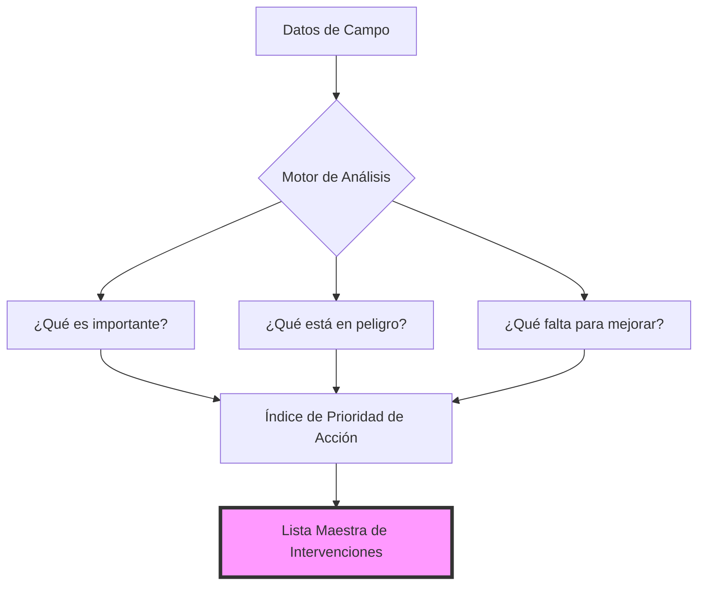

# Guía de Funcionamiento: Historia 1 - ¿Dónde Actuar Primero?

Esta guía explica de forma clara y sencilla cómo funciona el motor de análisis detrás de la **Historia 1**. El objetivo es entender cómo pasamos de los datos recolectados en campo a una lista de prioridades para la acción.

---

## El Objetivo General

La Historia 1 busca responder: **¿Qué medios de vida (actividades económicas o recursos) necesitan apoyo con mayor urgencia y por qué?**

Para lograrlo, el sistema combina tres ingredientes principales:

1. **Importancia:** ¿Qué tanto le importa esto a la gente?
2. **Riesgo:** ¿Qué tan amenazado está por el clima y otros factores?
3. **Capacidad:** ¿Qué tan preparada está la comunidad para enfrentar problemas por su cuenta?

---

## Los 6 Pasos del Proceso

### 1. Construcción del Mapa Geográfico

Antes de calcular nada, el sistema organiza el "donde". Asegura que cada dato (de una encuesta o un taller) esté vinculado correctamente a su país, paisaje y grupo de trabajo.

- **Resultado:** Una base sólida para poder ver resultados por región o por grupo comunitario.

### 2. Midiendo la Importancia (Prioridad)

Aquí el sistema analiza los talleres donde la comunidad asignó puntajes a sus actividades (agricultura, café, turismo, etc.).

- **¿Qué hace?** Promedia las opiniones de todos para saber qué es vital para la identidad y economía local.
- **Resultado:** Un ranking de "Lo más valorado" por la gente.

### 3. Evaluando las Amenazas

El sistema mira qué tan graves son las amenazas reportadas (como sequías o plagas).

- **¿Qué hace?** Combina la frecuencia (qué tan seguido pasa), el alcance (qué tanto terreno afecta) y la intensidad (qué tan fuerte pega).
- **Resultado:** Una lista de las amenazas más "pesadas" para el territorio.

### 4. Calculando el Riesgo Real

No basta con saber que hay sequía; hay que saber a quién le pega. Aquí cruzamos las amenazas con los medios de vida.

- **¿Qué hace?** Si una amenaza es muy fuerte (Paso 3) y la actividad es muy sensible a ella (ej. el café es muy sensible a la roya), el riesgo sube.
- **Resultado:** Sabemos qué actividades están en verdadero peligro.

### 5. Identificando la Brecha de Capacidad

Analizamos las encuestas donde se pregunta sobre acceso a crédito, capacitación, tecnología, etc.

- **¿Qué hace?** Buscamos dónde hay "huecos". Si una comunidad tiene mucha importancia y riesgo, pero no tiene herramientas para defenderse, hay una **brecha**.
- **Resultado:** Un indicador de "falta de herramientas" para cada actividad.

### 6. El Índice de Prioridad de Acción (API)

Este es el paso final. Mezclamos la **Importancia**, el **Riesgo** y la **Falta de Herramientas** en un solo número.

- **¿Qué hace?** Ordena todo de mayor a menor urgencia.
- **Escenarios:** Podemos ajustar el cálculo para que "pese" más el riesgo climático o que "pese" más la falta de recursos económicos, dándonos diferentes perspectivas de solución.

---

## ¿Cómo se ve el flujo de información?

## En Resumen

Este proceso asegura que las decisiones no se tomen "a dedo". Cada recomendación de acción está respaldada por:

1. La voz de la comunidad (**Prioridad**).
2. La realidad del clima (**Riesgo**).
3. La situación socioeconómica (**Capacidad**).
