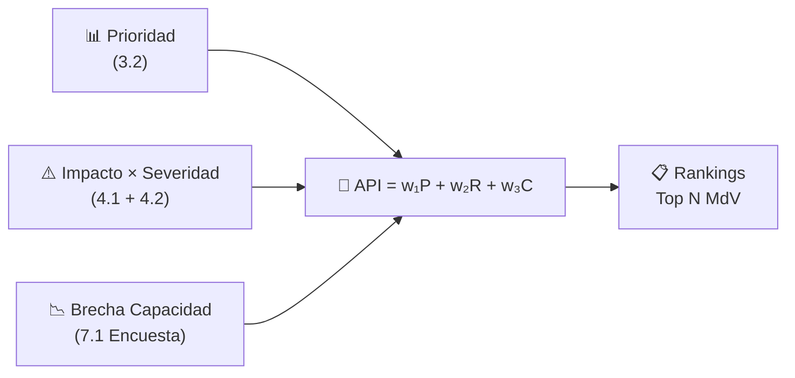

# Cálculo de Métricas - Storyline 1: ¿Dónde Actuar Primero?

Este documento explica cómo se calculan las métricas clave del Storyline 1 para identificar prioridades de acción en Soluciones basadas en la Naturaleza (SbN).

---

## 1. Puntaje de Prioridad

**Tabla Fuente:** `TIDY_3_2_PRIORIZACION` (Hoja 3.2)

### Fórmula:
```
prioridad_norm = MinMax( promedio(i_total) por MdV )
```

### Proceso:
1. Agrupa los datos por `mdv_id` (Medio de Vida)
2. Calcula el **promedio** de la columna `i_total` (puntaje total de importancia)
3. También calcula promedios de los componentes individuales si están presentes
4. **Normaliza** usando min-max: `(x - min) / (max - min)` → rango [0, 1]

### Resultado:
- Valor entre 0 y 1
- **Mayor valor = Mayor prioridad** según la comunidad

---

## 2. Puntaje de Impacto/Riesgo

**Tablas Fuente:** `TIDY_4_2_1_AMENAZA_MDV` + `TIDY_4_1_AMENAZAS`

### Fórmula:
```
impacto_total = SUMA(economico, social, salud, educacion, ambiente, politico, conflicto, migracion)

impacto_ponderado = impacto_total × severidad_amenaza_norm

riesgo_norm = MinMax( SUMA(impacto_ponderado) por MdV )
```

### Proceso:
1. Suma las **8 dimensiones de impacto** por cada par amenaza-MdV → `impacto_total`
2. Une con la severidad de amenazas (de 4.1), ya normalizada
3. **Impacto ponderado** = impacto × severidad de amenaza
4. Agrega por MdV → `suma_impacto_ponderado`
5. **Normaliza** a rango [0, 1]

### Dimensiones de Impacto:
| Columna | Descripción |
|---------|-------------|
| economico | Impacto económico |
| social | Impacto social |
| salud | Impacto en salud |
| educacion | Impacto en educación |
| ambiente | Impacto ambiental |
| politico | Impacto político |
| conflicto | Relación con conflictos |
| migracion | Impacto en migración |

### Resultado:
- Valor entre 0 y 1
- **Mayor valor = Mayor riesgo** para el MdV

---

## 3. Brecha de Capacidad Adaptativa

**Tablas Fuente:** `TIDY_7_1_RESPONSES` + `TIDY_7_1_RESPONDENTS` (Encuesta CA)

### Fórmula:
```
respuesta_0_1 = conversión_punto_medio(respuesta)  # ej: "20-40" → 0.30

capacidad = promedio(respuesta_0_1) por MdV

brecha_capacidad = 1 - capacidad

brecha_norm = MinMax(brecha_capacidad)
```

### Proceso:
1. Convierte respuestas de encuesta a escala numérica [0, 1]:
   - "0-20" → 0.10
   - "20-40" → 0.30
   - "40-60" → 0.50
   - "60-80" → 0.70
   - "80-100" → 0.90
2. Calcula el **promedio** de respuestas por MdV
3. **Brecha de capacidad** = `1 - capacidad` (mayor brecha = menor capacidad)
4. Identifica las **preguntas con menor puntaje** (cuellos de botella)

### Resultado:
- Valor entre 0 y 1
- **Mayor valor = Mayor brecha** de capacidad adaptativa

---

## 4. Índice de Prioridad de Acción (API)

### Fórmula MCDA:
```
API = w₁ × prioridad_norm + w₂ × riesgo_norm + w₃ × brecha_capacidad_norm
```

### Escenarios de Pesos:
| Escenario | w_prioridad | w_riesgo | w_capacidad |
|-----------|------------|----------|-------------|
| **Balanceado** | 0.40 | 0.40 | 0.20 |
| **Prioridad MdV** | 0.50 | 0.30 | 0.20 |
| **Prioridad Riesgo** | 0.30 | 0.50 | 0.20 |

### Proceso:
1. Todas las entradas ya están **normalizadas [0, 1]**
2. Los pesos suman 1.0
3. Se calcula el API para cada escenario
4. Se generan **rankings de los Top N** MdV por escenario

### Resultado:
- Valor entre 0 y 1
- **Mayor valor = Mayor prioridad** para intervención SbN

---

## Diagrama Resumen



---

## Interpretación para la Toma de Decisiones

| Métrica Alta | Significado | Acción Recomendada |
|--------------|-------------|-------------------|
| Prioridad | MdV importante para la comunidad | Considerar para SbN |
| Riesgo | MdV muy afectado por amenazas | Intervención urgente |
| Brecha Capacidad | Comunidad con poca capacidad adaptativa | Fortalecer capacidades |
| **API Alto** | **Prioridad combinada máxima** | **Focalizar intervención SbN** |

---

## Referencias

- IUCN Global Standard for Nature-based Solutions v2.0
- IPCC AR6 Working Group II (Impacts, Adaptation and Vulnerability)
- Multi-Criteria Decision Analysis (MCDA) - UK Government Guidance

---

*Generado por el Pipeline PARES Storyline 1 | Metodología PARES*
