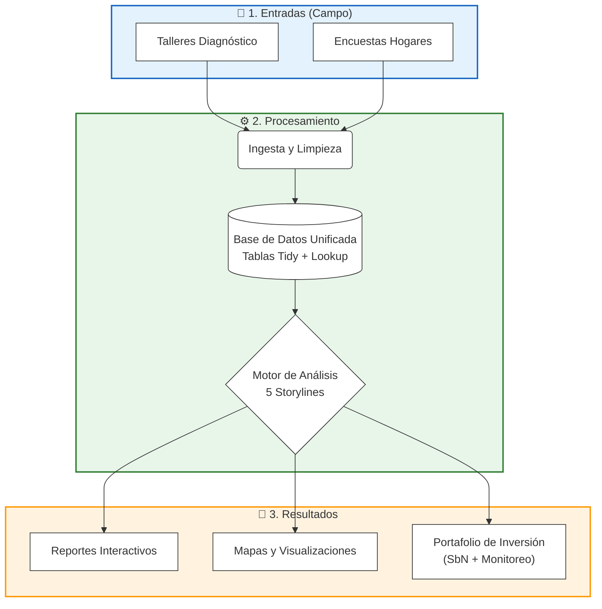

# Sistema de anaisis de datos PARES — Resumen (Versión Corta)

## ¿Qué es?

Una plataforma tecnológica que transforma datos crudos de campo en **planes de inversión estratégica** para Soluciones basadas en la Naturaleza (SbN) dentro del contexto del proyecto PARES.

## ¿Cómo funciona?

1.  **Ingesta**: Archivos Excel estandarizados de los talleres de diagnóstico y las encuestas de CA.
2.  **Análisis**: Ejecuta 5 líneas temáticas ("Storylines") automáticas.
3.  **Salida**: Genera reportes interactivos, mapas y portafolios de proyectos listos para financiamiento.

## Los 5 Pilares de Análisis (Storylines)

- **1. Priorización**: Responde _¿Dónde actuar primero?_ combinando urgencia comunitaria, riesgo climático y brechas de capacidad.
- **2. Líneas de Vida**: Identifica los ecosistemas que funcionan como "infraestructura crítica" para los medios de vida locales.
- **3. Equidad y Vulnerabilidad**: Aplica salvaguardas de "No Acción con Daño" para asegurar la inclusión de grupos vulnerables (género, juventud).
- **4. Gobernanza y Conflicto**: Evalúa la viabilidad política, identificando actores clave ("champions") y riesgos de conflicto.
- **5. Portafolio y Monitoreo**: Entrega un plan de inversiones clasificado ("Hacer ya" vs "Hacer después") con su sistema de monitoreo con sus indicadores mínimos (MEAL) automático.

## ¿Por qué usarlo?

- **Velocidad**: Reduce semanas de análisis manual a minutos de procesamiento.
- **Transparencia**: Cada recomendación es trazable hasta el dato de campo original.
- **Estándares Globales**: Alineado metodológicamente con:
  - **UICN** (Estándar Global SbN)
  - **IPCC** (Evaluación de vulnerabilidad AR6)
  - **MCDA** (Mejores prácticas de decisión multicriterio)

## Resumen Visual del Proceso

## Análisis de Costos y Mantenimiento

El sistema ha sido desplegado utilizando una arquitectura eficiente y de bajo costo mediante **Hetzner Cloud** (infraestructura) y **Coolify** (gestión de despliegues). A continuación se detalla la estructura de costos operativos.

### 1. Costos de Infraestructura (Mensual)

| Ítem                         | Costo Estimado       | Descripción Técnica                                                                                                     |
| :--------------------------- | :------------------- | :---------------------------------------------------------------------------------------------------------------------- |
| **Servidor VPS (Hetzner)**   | **€7.50 - €14.00**   | Instancia CPX21 (3 vCPU, 4GB RAM) o CPX31 (4 vCPU, 8GB RAM). Suficiente para procesar los libros Excel y servir la web. |
| **Almacenamiento y Backups** | **€1.50 - €3.00**    | Snapshots automáticos del servidor (20% del costo de instancia) para recuperación ante desastres.                       |
| **Dirección IP**             | **€0.50**            | IPv4 pública dedicada.                                                                                                  |
| **Licencia Coolify**         | **€0.00**            | Versión _Self-Hosted_ (Community Edition) es gratuita y open source.                                                    |
| **Certificados SSL**         | **€0.00**            | Generación y renovación automática gratuita vía Let's Encrypt (gestionado por Coolify).                                 |
| **TOTAL MENSUAL**            | **~€10.00 - €18.00** | **Costo operativo extremadamente competitivo.**                                                                         |

### 2. Mantenimiento Técnico Requerido

Gracias a la automatización con Coolify, el mantenimiento se reduce drásticamente:

- **Despliegues (Automático)**: El sistema se actualiza automáticamente al hacer `git push` en el repositorio. Coolify detecta los cambios, construye el contenedor Docker y lo despliega sin intervención manual.
- **Certificados (Automático)**: La renovación de SSL es gestionada por Coolify.
- **Mantenimiento del Servidor (Manual - 1h/mes)**: Se recomienda una revisión mensual para actualizaciones de seguridad del sistema operativo (Ubuntu/Debian) y limpieza de imágenes Docker.

> **Conclusión**: Esta arquitectura ofrece un **balance costo-beneficio excepcional**, manteniendo costos fijos muy bajos (<€20/mes) sin sacrificar rendimiento ni control.
