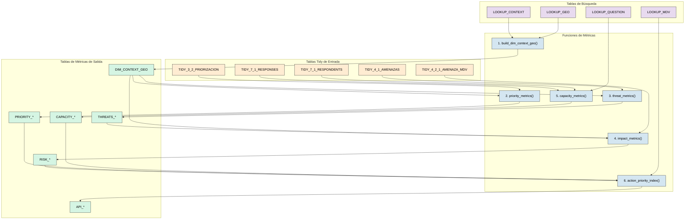
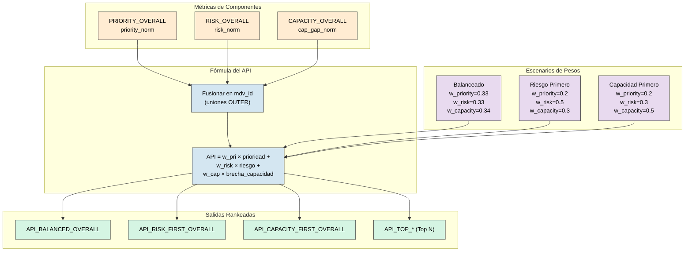

# Storyline 1: Auditoría de Priorización

Este documento proporciona una **auditoría detallada y neutral** del pipeline de análisis `storyline1/metrics.py`. Lista cada función, sus tablas de entrada, las columnas que utiliza y las uniones (joins) que realiza.

---

## Orquestación: `compute_all_metrics()`

Esta es la función principal (línea 753). Llama a las siguientes funciones en orden:

1.  `build_dim_context_geo()` -> `DIM_CONTEXT_GEO`
    *Construye la tabla de dimensión geográfica vinculando contextos con sus metadatos geográficos (país, paisaje, grupo). Esta es la base sobre la cual se anclan todas las demás métricas, permitiendo agregar resultados por territorio.*

2.  `priority_metrics()` -> `PRIORITY_OVERALL`, `PRIORITY_BY_GRUPO`, `PRIORITY_FIELD_RANKING`
    *Calcula la importancia de cada medio de vida (MdV) para la comunidad según las puntuaciones de priorización participativa. Lee los datos de la hoja 3.2 donde las comunidades asignaron puntajes de importancia a cada MdV, los promedia y normaliza para obtener un ranking.*

3.  `threat_metrics()` -> `THREATS_OVERALL`, `THREATS_BY_GRUPO`
    *Calcula la severidad de cada amenaza basándose en las evaluaciones comunitarias de la hoja 4.1 (frecuencia, alcance, intensidad). Genera una puntuación normalizada de severidad que se usará como peso en el cálculo de riesgo.*

4.  `impact_metrics()` -> `RISK_OVERALL`, `RISK_BY_GRUPO`, `TOP_THREAT_DRIVERS_*`
    *Calcula el riesgo combinando el impacto directo de cada amenaza sobre cada MdV (pérdida, calidad, acceso de la hoja 4.2.1) con la severidad de esa amenaza. Usa la fórmula Riesgo = Impacto × Severidad. También identifica las "top threat drivers" (principales amenazas causantes) para cada MdV.*

5.  `capacity_metrics()` -> `CAPACITY_OVERALL`, `CAPACITY_BY_GRUPO`, `CAPACITY_*_QUESTIONS`
    *Mide la capacidad adaptativa a partir de respuestas de encuestas de la hoja 7.1. Calcula promedios de respuestas por MdV y por pregunta, luego invierte el resultado para obtener "brecha de capacidad" (1 - capacidad), ya que interesa identificar dónde hay déficit.*

6.  `action_priority_index()` -> `API_*_OVERALL`, `API_*_BY_GRUPO`, `API_TOP_*`
    *Combina prioridad, riesgo y brecha de capacidad en un único Índice de Prioridad de Acción (API) usando una suma ponderada. Genera múltiples escenarios de pesos (balanceado, riesgo-primero, capacidad-primero) para explorar diferentes perspectivas de priorización. El resultado final es un ranking de qué MdVs necesitan intervención primero.*

### Diagrama de Flujo de Orquestación



---

## Función 1: `build_dim_context_geo()` (Línea 71)

**Propósito:** Construye una tabla de dimensión uniendo las tablas de búsqueda de Contexto y Geografía.

### Explicación del Razonamiento

Esta función es el **primer paso crítico** del pipeline porque establece el "esqueleto" geográfico que vincula todos los datos posteriores. He aquí por qué:

1. **¿Por qué se necesitan dos tablas?**
   - `LOOKUP_CONTEXT` contiene los **identificadores únicos de contexto** (`context_id`) que representan cada combinación única de país-paisaje-grupo-fecha. Es la tabla que identifica "cuándo y dónde" se recolectó cada dato.
   - `LOOKUP_GEO` contiene los **atributos geográficos detallados** (nombre del país `admin0`, nombre del paisaje, región, etc.). Mantener esta información separada evita redundancia y permite actualizaciones centralizadas.

2. **¿Por qué una unión LEFT?**
   - Se usa LEFT JOIN para garantizar que **todos los contextos se conserven**, incluso si por algún error de datos falta información geográfica. Esto previene la pérdida silenciosa de registros y facilita la detección de datos incompletos (los registros sin match tendrán valores nulos en las columnas geográficas).

3. **¿Cuál es el resultado?**
   - La tabla `DIM_CONTEXT_GEO` resultante es una **tabla de dimensión** en el sentido de modelado dimensional (star schema). Todas las demás métricas se vinculan a esta tabla mediante `context_id`, permitiendo agregar resultados por país, paisaje o grupo de trabajo.

4. **¿Por qué es la primera función?**
   - Debe ejecutarse primero porque las funciones siguientes (`priority_metrics`, `threat_metrics`, etc.) necesitan la tabla `DIM_CONTEXT_GEO` para adjuntar contexto geográfico a sus resultados y poder agrupar por `grupo`.

| Tabla de Entrada | Columna(s) Usada(s) | Tipo de Unión |
|:---|:---|:---|
| `LOOKUP_CONTEXT` | `geo_id` (o `id_geo`) | LEFT (origen) |
| `LOOKUP_GEO` | `geo_id` (o `id_geo`) | LEFT (destino) |

**Unión:**
```python
result = ctx.merge(geo, left_on=ctx_geo_col, right_on=geo_geo_col, how="left")
```

**Columnas de Salida:** `context_id`, `grupo`, `paisaje`, `admin0`, `fecha_iso`.

---

## Función 2: `priority_metrics()` (Línea 100)

**Propósito:** Agrega puntuaciones de prioridad por Medio de Vida (MdV).

### Explicación del Razonamiento

Esta función responde a la pregunta: **"¿Cuáles medios de vida son más importantes para la comunidad?"**

1. **¿De dónde vienen los datos?**
   - La tabla `TIDY_3_2_PRIORIZACION` contiene los resultados de ejercicios participativos donde las comunidades priorizaron sus medios de vida. La columna `i_total` representa la puntuación de importancia agregada.

2. **¿Por qué se agrega por medio de vida?**
   - Un mismo medio de vida puede aparecer en múltiples contextos (diferentes paisajes, diferentes grupos). Se calcula el promedio (`mean_i_total`) para obtener una puntuación representativa global.

3. **¿Por qué normalizar con minmax?**
   - La normalización 0-1 permite comparar la prioridad con otras métricas (riesgo, capacidad) que tienen diferentes escalas originales. Sin normalización, no podríamos combinarlas en el API final.

4. **¿Qué significa la salida?**
   - `PRIORITY_OVERALL`: Ranking global de todos los MdV por importancia.
   - `PRIORITY_BY_GRUPO`: Mismo ranking pero desagregado por grupo de trabajo (permite ver diferencias regionales).
   - `PRIORITY_FIELD_RANKING`: Ranking estilo "campo" con posiciones (1°, 2°, 3°...).

| Tabla de Entrada | Columnas Candidatas |
|:---|:---|
| `TIDY_3_2_PRIORIZACION` | `mdv_id`, `i_total` (importancia total) |
| `DIM_CONTEXT_GEO` | `context_id`, `grupo` |

**Cálculos Internos:**
1.  `groupby([mdv_id])` -> `mean_i_total`.
2.  Normalización `minmax()` -> `priority_norm`.

**Unión 1:** Adjuntar contexto geográfico.
```python
df = safe_merge(df, dim_context_geo, on="context_id", how="left")
```

**Salida:** `PRIORITY_OVERALL`, `PRIORITY_BY_GRUPO`, `PRIORITY_FIELD_RANKING`.

---

## Función 3: `threat_metrics()` (Línea 210)

**Propósito:** Calcula métricas de severidad de amenazas del inventario de amenazas.

### Explicación del Razonamiento

Esta función responde a la pregunta: **"¿Qué tan severa es cada amenaza?"**

1. **¿Qué representa la columna `suma`?**
   - Es la puntuación de severidad compuesta que combina frecuencia, alcance e intensidad de cada amenaza, según la evaluación de la comunidad.

2. **¿Por qué calcular el promedio por amenaza?**
   - Una misma amenaza (ej: sequía, inundaciones) puede afectar múltiples paisajes con diferentes intensidades. El promedio da una medida general de qué tan severa es esa amenaza en todo el territorio.

3. **¿Cómo se usa esta información después?**
   - La severidad normalizada (`suma_norm`) se usa como **multiplicador de peso** en la Función 4 (`impact_metrics`). Una amenaza muy severa amplifica el impacto que tiene sobre los medios de vida.

4. **¿Por qué separar amenazas de impactos?**
   - Separar la severidad intrínseca de una amenaza (esta función) de su impacto específico sobre cada MdV (Función 4) permite mayor flexibilidad analítica y evita doble conteo.

| Tabla de Entrada | Columnas Candidatas |
|:---|:---|
| `TIDY_4_1_AMENAZAS` | `amenaza_id`, `suma` (puntuación de severidad) |
| `DIM_CONTEXT_GEO` | `context_id`, `grupo` |

**Cálculos Internos:**
1.  `groupby([amenaza_id])` -> `mean_suma`.
2.  Normalización `minmax()` -> `suma_norm`.

**Uniones:** Adjuntar contexto geográfico.

**Salida:** `THREATS_OVERALL`, `THREATS_BY_GRUPO`.

---

## Función 4: `impact_metrics()` (Línea 284)

**Propósito:** Calcula el riesgo ponderando el impacto de amenazas con la severidad de amenazas.

### Explicación del Razonamiento

Esta función responde a la pregunta: **"¿Qué tan en riesgo está cada medio de vida?"** Es la intersección entre amenazas y medios de vida.

1. **¿Qué representan las columnas de impacto?**
   - `perdida`: Pérdida de cantidad/volumen del MdV.
   - `calidad`: Degradación de la calidad del producto/servicio.
   - `acceso`: Dificultad de acceso al recurso.
   - La suma de estas dimensiones = `impact_total` (impacto multidimensional).

2. **¿Por qué multiplicar impacto × severidad?**
   - Esta es la fórmula clásica de riesgo: **Riesgo = Impacto × Probabilidad/Severidad**.
   - Un impacto alto de una amenaza poco severa es menos preocupante que un impacto moderado de una amenaza muy severa.

3. **¿Por qué sumar todos los impactos ponderados por MdV?**
   - Un medio de vida puede ser afectado por múltiples amenazas. La suma total captura la **exposición acumulada** a todas las amenazas.

4. **¿Qué son los TOP_THREAT_DRIVERS?**
   - Identifican cuáles amenazas específicas contribuyen más al riesgo de cada MdV. Útil para diseñar intervenciones focalizadas.

| Tabla de Entrada | Columnas Candidatas |
|:---|:---|
| `TIDY_4_2_1_AMENAZA_MDV` | `mdv_id`, `amenaza_id`, `perdida`, `calidad`, `acceso` |
| `THREATS_OVERALL` | `amenaza_id`, `suma_norm` |
| `DIM_CONTEXT_GEO` | `context_id`, `grupo` |

**Cálculos Internos:**
1.  Sumar columnas de impacto -> `impact_total`.
2.  `weighted_impact = impact_total * suma_norm`.
3.  `groupby([mdv_id])` -> `sum(weighted_impact)`.
4.  `minmax()` -> `risk_norm`.

**Unión 1 (Línea ~310):** Fusionar severidad de amenaza en tabla de impacto.
```python
df = safe_merge(df, threats_overall[["amenaza_id", "suma_norm"]], on="amenaza_id", how="left")
```

**Salida:** `RISK_OVERALL`, `RISK_BY_GRUPO`, `TOP_THREAT_DRIVERS_OVERALL`, `TOP_THREAT_DRIVERS_BY_GRUPO`.

---

## Función 5: `capacity_metrics()` (Línea 416)

**Propósito:** Calcula la capacidad adaptativa a partir de respuestas de encuestas.

### Explicación del Razonamiento

Esta función responde a la pregunta: **"¿Qué tan preparadas están las comunidades para adaptarse?"**

1. **¿Por qué necesitamos dos tablas para encuestas?**
   - `TIDY_7_1_RESPONDENTS`: Contiene **quién** respondió y **a qué MdV** está asociado. Un encuestado puede estar vinculado a varios MdV.
   - `TIDY_7_1_RESPONSES`: Contiene las **respuestas individuales** a cada pregunta de la encuesta.
   - Esta separación normalizada evita redundancia y permite análisis flexibles por pregunta o por encuestado.

2. **¿Qué mide `response_numeric`?**
   - Es la respuesta convertida a escala numérica 0-1, donde 1 = capacidad alta y 0 = capacidad nula. Ejemplo: "¿Tiene acceso a crédito?" Sí=1, No=0.

3. **¿Por qué invertir para obtener `capacity_gap`?**
   - El API busca identificar **dónde actuar primero**. Un MdV con alta capacidad no necesita intervención urgente. Por eso usamos `gap = 1 - capacity`: mayor brecha = mayor necesidad.

4. **¿Para qué sirven las tablas *_QUESTIONS?**
   - Identifican cuáles preguntas específicas tienen las puntuaciones más bajas versus más altas. Esto ayuda a diseñar intervenciones focalizadas (ej: si la pregunta sobre "acceso a crédito" puntúa bajo, se puede priorizar programas de microfinanzas).

| Tabla de Entrada | Columnas Candidatas |
|:---|:---|
| `TIDY_7_1_RESPONDENTS` | `respondent_id`, `mdv_id`, `grupo` |
| `TIDY_7_1_RESPONSES` | `respondent_id`, `response_numeric` |
| `LOOKUP_QUESTION` | `question_code`, `question_text` |

**Cálculos Internos:**
1.  Unir respuestas con encuestados por `respondent_id`.
2.  `groupby([mdv_id])` -> `mean(response_numeric)` = `capacity_avg`.
3.  `capacity_gap = 1 - capacity_avg`.
4.  `minmax()` -> `cap_gap_norm`.

**Unión 1:** Vincular respuestas con metadatos del encuestado.
```python
df = tidy_responses.merge(tidy_respondents, on="respondent_id", how="left")
```

**Unión 2:** Enriquecer con texto de pregunta.
```python
df = df.merge(lookup_questions, on="question_code", how="left")
```

**Salida:** `CAPACITY_OVERALL`, `CAPACITY_BY_GRUPO`, `CAPACITY_OVERALL_QUESTIONS`, `CAPACITY_BY_GRUPO_QUESTIONS`.

---

## Función 6: `action_priority_index()` (Línea 544)

**Propósito:** Calcula el ranking final del API usando componentes ponderados.

### Explicación del Razonamiento

Esta es la **función culminante** del pipeline. Responde a la pregunta: **"¿Dónde debemos actuar primero?"**

1. **¿Por qué combinar tres métricas?**
   - **Prioridad**: Lo que la comunidad considera importante (demanda social).
   - **Riesgo**: Lo que está más expuesto a amenazas (vulnerabilidad técnica).
   - **Brecha de capacidad**: Donde hay menos recursos para adaptarse (necesidad de apoyo).
   - Un MdV que puntúe alto en las tres dimensiones es candidato crítico para intervención.

2. **¿Por qué usar uniones OUTER?**
   - Algunos MdV pueden tener datos de prioridad pero no de encuestas (o viceversa). OUTER JOIN conserva todos los registros, llenando con valores nulos donde falten datos. Esto previene la exclusión silenciosa de MdV.

3. **¿Qué significan los diferentes escenarios de pesos?**
   - **Balanced (0.33, 0.33, 0.34)**: Pondera igual las tres dimensiones.
   - **Risk-First (0.2, 0.5, 0.3)**: Prioriza intervenir donde hay más riesgo climático.
   - **Capacity-First (0.2, 0.3, 0.5)**: Prioriza intervenir donde hay más brecha de capacidad.
   - Diferentes escenarios permiten explorar "qué pasaría si cambiamos las prioridades".

4. **¿Por qué es una suma ponderada y no algo más complejo?**
   - La simplicidad es intencional: es fácil de explicar a tomadores de decisiones, transparente y auditable. Modelos más complejos (como multiplicativos) pueden ser menos interpretables.

| Tabla de Entrada | Columna(s) Usada(s) |
|:---|:---|
| `PRIORITY_OVERALL` | `mdv_id`, `priority_norm` |
| `PRIORITY_BY_GRUPO` | `mdv_id`, `grupo`, `priority_norm` |
| `RISK_OVERALL` | `mdv_id`, `risk_norm` |
| `RISK_BY_GRUPO` | `mdv_id`, `grupo`, `risk_norm` |
| `CAPACITY_OVERALL` | `mdv_id`, `cap_gap_norm` |
| `CAPACITY_BY_GRUPO` | `mdv_id`, `grupo`, `cap_gap_norm` |
| `LOOKUP_MDV` | `mdv_id`, `mdv_name` |

**Unión 1:** Fusionar prioridad, riesgo y capacidad en `mdv_id`.
```python
merged = priority_df.merge(risk_df, on="mdv_id", how="outer")
merged = merged.merge(capacity_df, on="mdv_id", how="outer")
```

**Unión 2:** Enriquecer con nombres de medios de vida.
```python
merged = merged.merge(lookup_mdv, on="mdv_id", how="left")
```

**Fórmula (Línea ~620):**
```python
API = w_priority * priority_norm + w_risk * risk_norm + w_capacity_gap * cap_gap_norm
```

**Salida:** `API_BALANCED_OVERALL`, `API_RISK_FIRST_OVERALL`, `API_CAPACITY_FIRST_OVERALL`, etc.

---

## Resumen de Todas las Uniones

| Función | Unión # | Tabla Izquierda | Tabla Derecha | Clave(s) de Unión | Tipo de Unión |
|:---|:---|:---|:---|:---|:---|
| `build_dim_context_geo` | 1 | `LOOKUP_CONTEXT` | `LOOKUP_GEO` | `geo_id` | LEFT |
| `priority_metrics` | 1 | df de Prioridad | `DIM_CONTEXT_GEO` | `context_id` | LEFT |
| `threat_metrics` | 1 | df de Amenazas | `DIM_CONTEXT_GEO` | `context_id` | LEFT |
| `impact_metrics` | 1 | df de Impacto | `THREATS_OVERALL` | `amenaza_id` | LEFT |
| `capacity_metrics` | 1 | `TIDY_7_1_RESPONSES` | `TIDY_7_1_RESPONDENTS` | `respondent_id` | LEFT |
| `capacity_metrics` | 2 | df de Capacidad | `LOOKUP_QUESTION` | `question_code` | LEFT |
| `action_priority_index` | 1 | df de Prioridad | df de Riesgo | `mdv_id` | OUTER |
| `action_priority_index` | 2 | df Fusionado | df de Capacidad | `mdv_id` | OUTER |
| `action_priority_index` | 3 | df de API | `LOOKUP_MDV` | `mdv_id` | LEFT |

---

## Flujo de Cálculo del API


