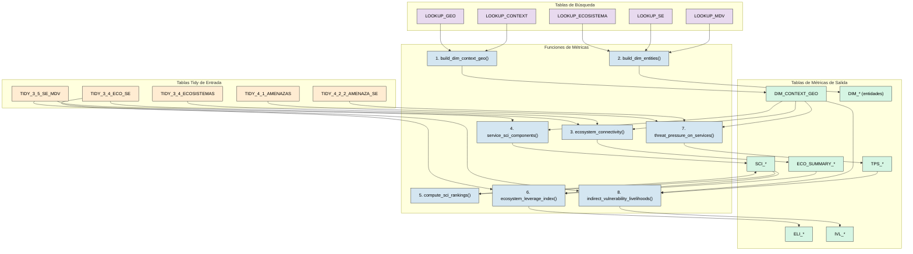
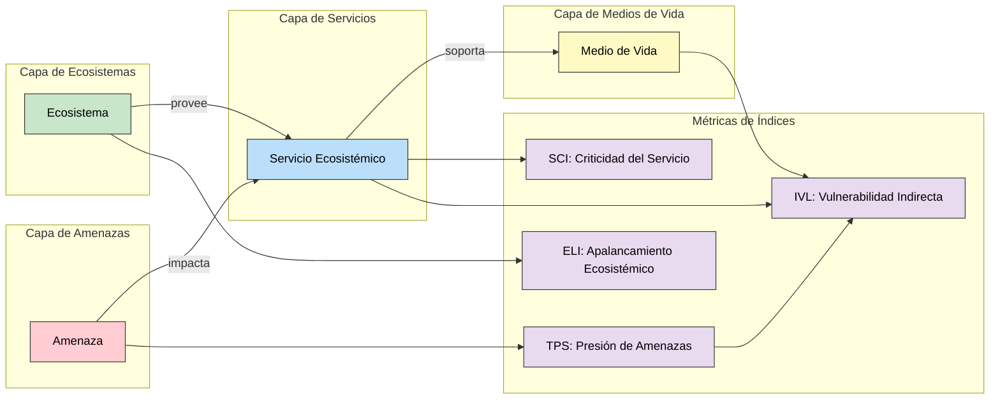

# Storyline 2: Auditoría de Líneas de Vida Ecosistema-Servicio

Este documento proporciona una **auditoría detallada y neutral** del pipeline de análisis `storyline2/metrics.py`. Lista cada función, sus tablas de entrada, las columnas que utiliza y las uniones (joins) que realiza.

---

## Orquestación: `compute_all_metrics()`

Esta es la función principal (línea 810). Llama a las siguientes funciones en orden:

1.  `build_dim_context_geo()` -> `DIM_CONTEXT_GEO`
    *Construye la tabla de dimensión geográfica vinculando contextos con sus metadatos geográficos. Esta es la base sobre la cual se anclan todas las demás métricas, permitiendo agregar resultados por territorio.*

2.  `build_dim_entities()` -> `DIM_MDV`, `DIM_SE`, `DIM_ECOSISTEMA`
    *Crea tablas de dimensión (catálogos) para Medios de Vida, Servicios Ecosistémicos y Ecosistemas. Estas tablas contienen los nombres legibles de cada entidad y permiten enriquecer los resultados numéricos con información descriptiva.*

3.  `ecosystem_connectivity()` -> `ECO_SUMMARY_OVERALL`, `ECO_SUMMARY_BY_GRUPO`
    *Calcula cuántos servicios y medios de vida soporta cada ecosistema, usando las hojas 3.4 y 3.5. Un ecosistema "más conectado" tiene más dependientes; perderlo tendría impactos en cascada mayores. Esta métrica es insumo para el cálculo del ELI.*

4.  `service_sci_components()` -> `SCI_COMPONENTS_OVERALL`, `SCI_COMPONENTS_BY_GRUPO`
    *Calcula los componentes del Índice de Criticidad del Servicio (SCI): número de usuarios, amplitud (cuántos MdV dependen del servicio) y estacionalidad (meses de escasez). Lee datos de la hoja 3.5 SE-MdV. Cada componente se normaliza 0-1 para poder combinarlos.*

5.  `compute_sci_rankings()` -> `SCI_*_OVERALL`, `SCI_*_BY_GRUPO`, `SCI_TOP_*`
    *Aplica diferentes escenarios de pesos a los componentes del SCI para generar rankings alternativos. Permite análisis de sensibilidad: ¿cambiaría el ranking si priorizamos usuarios sobre amplitud? Genera tablas "TOP" con los servicios más críticos.*

6.  `ecosystem_leverage_index()` -> `ELI_OVERALL`, `ELI_BY_GRUPO`
    *Calcula el Índice de Apalancamiento Ecosistémico combinando conectividad del ecosistema con la criticidad promedio de los servicios que soporta. Ecosistemas con alto ELI son candidatos prioritarios para conservación porque protegerlos beneficia desproporcionadamente a servicios críticos.*

7.  `threat_pressure_on_services()` -> `TPS_OVERALL`, `TPS_BY_GRUPO`
    *Calcula la presión de amenazas sobre servicios ecosistémicos usando los datos de la hoja 4.2.2. Aplica la misma lógica de Riesgo = Impacto × Severidad que Storyline 1, pero sobre servicios en lugar de medios de vida.*

8.  `indirect_vulnerability_livelihoods()` -> `IVL_OVERALL`, `IVL_BY_GRUPO`
    *Calcula la vulnerabilidad indirecta de medios de vida propagando la presión de amenazas (TPS) a través de la cadena Ecosistema → Servicio → MdV. Un MdV puede no estar amenazado directamente pero ser vulnerable porque depende de servicios bajo presión.*

### Diagrama de Flujo de Orquestación



---

## Función 1: `build_dim_context_geo()` (Línea 132)

**Propósito:** Construye una tabla de dimensión uniendo las tablas de búsqueda de Contexto y Geografía.

### Explicación del Razonamiento

Igual que en Storyline 1, esta función crea el "esqueleto" geográfico. Ver explicación detallada en Storyline 1, Función 1.

| Tabla de Entrada | Columna(s) Usada(s) | Tipo de Unión |
|:---|:---|:---|
| `LOOKUP_CONTEXT` | `geo_id` | LEFT (origen) |
| `LOOKUP_GEO` | `geo_id` | LEFT (destino) |

**Columnas de Salida:** `context_id`, `grupo`, `paisaje`, `admin0`, `fecha_iso`.

---

## Función 2: `build_dim_entities()` (Línea 148)

**Propósito:** Construye tablas de dimensión para MdV, Servicios Ecosistémicos y Ecosistemas.

### Explicación del Razonamiento

Esta función crea el **vocabulario controlado** del análisis.

1. **¿Por qué necesitamos tablas de dimensión de entidades?**
   - Las tablas TIDY contienen IDs (`mdv_id`, `se_id`, `ecosistema_id`) pero no siempre los nombres legibles.
   - Las tablas DIM permiten enriquecer cualquier resultado con nombres humanos (ej: de `mdv_id=5` a `"Ganadería bovina"`).

2. **¿Por qué separar entidades de hechos?**
   - Es un principio de modelado dimensional (star schema). Los "hechos" (transacciones, mediciones) se mantienen separados de las "dimensiones" (catálogos de referencia).
   - Facilita actualizaciones: si un nombre de servicio cambia, solo se actualiza en un lugar.

3. **¿Qué entidades cubre Storyline 2?**
   - `DIM_MDV`: Medios de Vida (agricultura, pesca, etc.).
   - `DIM_SE`: Servicios Ecosistémicos (provisión de agua, polinización, etc.).
   - `DIM_ECOSISTEMA`: Ecosistemas (bosque, humedal, río, etc.).

| Tabla de Entrada | Salida |
|:---|:---|
| `LOOKUP_MDV` | `DIM_MDV` |
| `LOOKUP_SE` | `DIM_SE` |
| `LOOKUP_ECOSISTEMA` | `DIM_ECOSISTEMA` |

**Uniones:** Ninguna (construcciones directas desde lookups).

---

## Función 3: `ecosystem_connectivity()` (Línea 223)

**Propósito:** Calcula métricas de conectividad para ecosistemas (cuántos servicios/MdVs soportan).

### Explicación del Razonamiento

Esta función responde a la pregunta: **"¿Qué tan conectado está cada ecosistema con el sistema socioecológico?"**

1. **¿Qué es la conectividad ecosistémica?**
   - Un ecosistema más "conectado" soporta más servicios y más medios de vida. Perderlo tendría impactos en cascada mayores.
   - `connectivity_raw = n_services + n_livelihoods`.

2. **¿De dónde vienen los vínculos?**
   - `TIDY_3_4_ECO_SE`: Mapea qué servicios provee cada ecosistema.
   - `TIDY_3_4_ECO_MDV` (si existe): Mapea qué MdVs dependen directamente de cada ecosistema.

3. **¿Por qué contar en lugar de ponderar?**
   - Un conteo simple es transparente y fácil de validar. Ponderaciones más complejas pueden introducirse en el ELI (Función 6).

4. **¿Cómo se usa esta información?**
   - Ecosistemas con alta conectividad son candidatos para **protección prioritaria**. Perderlos afectaría a muchos servicios y medios de vida simultáneamente.

| Tabla de Entrada | Columnas Candidatas |
|:---|:---|
| `TIDY_3_4_ECOSISTEMAS` | `ecosistema_id`, atributos del ecosistema |
| `TIDY_3_4_ECO_SE` | `ecosistema_id`, `se_id` |
| `TIDY_3_4_ECO_MDV` | `ecosistema_id`, `mdv_id` |
| `DIM_CONTEXT_GEO` | `context_id`, `grupo` |

**Cálculos Internos:**
1.  `groupby([ecosistema_id])` -> contar únicos `se_id` -> `n_services`.
2.  `groupby([ecosistema_id])` -> contar únicos `mdv_id` -> `n_livelihoods`.
3.  `connectivity_raw = n_services + n_livelihoods`.

**Salida:** `ECO_SUMMARY_OVERALL`, `ECO_SUMMARY_BY_GRUPO`.

---

## Función 4: `service_sci_components()` (Línea 365)

**Propósito:** Calcula los componentes del Índice de Criticidad del Servicio (SCI).

### Explicación del Razonamiento

Esta función responde a la pregunta: **"¿Qué tan crítico es cada servicio ecosistémico para la comunidad?"**

1. **¿Qué componentes forman el SCI?**
   - **Usuarios (`nr_usuarios`)**: Cuántas personas usan el servicio. Más usuarios = más crítico.
   - **Amplitud (`breadth`)**: Cuántos medios de vida diferentes dependen del servicio. Mayor diversidad = más crítico.
   - **Estacionalidad (`mes_falta`)**: En qué meses el servicio escasea. Mayor escasez estacional = más crítico.

2. **¿Por qué estos tres componentes?**
   - Capturan diferentes dimensiones de criticidad:
     - Social (usuarios).
     - Económica (amplitud de MdVs).
     - Temporal (vulnerabilidad estacional).

3. **¿Por qué normalizar cada componente?**
   - Cada componente tiene escalas diferentes (usuarios pueden ser miles, amplitud es conteo de MdVs).
   - La normalización 0-1 permite combinarlos en una fórmula ponderada.

4. **Fórmula del SCI:**
   ```python
   SCI = w_users * users_norm + w_breadth * breadth_norm + w_seasonality * seasonality_norm
   ```

| Tabla de Entrada | Columnas Candidatas |
|:---|:---|
| `TIDY_3_5_SE_MDV` | `se_id`, `mdv_id`, `nr_usuarios`, `mes_falta` |
| `DIM_CONTEXT_GEO` | `context_id`, `grupo` |

**Salida:** `SCI_COMPONENTS_OVERALL`, `SCI_COMPONENTS_BY_GRUPO`.

---

## Función 5: `compute_sci_rankings()` (Línea 467)

**Propósito:** Calcula rankings del SCI para diferentes escenarios de pesos.

### Explicación del Razonamiento

Esta función permite **análisis de sensibilidad** sobre el SCI.

1. **¿Por qué múltiples escenarios de pesos?**
   - Diferentes stakeholders pueden priorizar de forma diferente:
     - Un planificador social prioriza **usuarios**.
     - Un economista prioriza **amplitud de MdVs**.
     - Un hidrólogo prioriza **estacionalidad** (escasez de agua).

2. **¿Qué escenarios típicos se calculan?**
   - `BALANCED`: Pondera igual todos los componentes.
   - `USERS_FIRST`: Da más peso a la cantidad de usuarios.
   - `BREADTH_FIRST`: Da más peso a la diversidad de MdVs soportados.

3. **¿Cómo usar los diferentes rankings?**
   - Comparar qué servicios aparecen en el top en todos los escenarios (robustez).
   - Identificar servicios que son críticos solo bajo ciertas perspectivas.

| Tabla de Entrada | Columna(s) Usada(s) |
|:---|:---|
| `SCI_COMPONENTS_OVERALL` | `se_id`, puntuaciones de componentes |
| `SCI_COMPONENTS_BY_GRUPO` | `se_id`, `grupo`, puntuaciones de componentes |
| Escenarios de pesos (YAML) | `w_users`, `w_breadth`, `w_seasonality`, etc. |

**Salida:** `SCI_BALANCED_OVERALL`, `SCI_USERS_FIRST_OVERALL`, `SCI_TOP_*`, etc.

---

## Función 6: `ecosystem_leverage_index()` (Línea 532)

**Propósito:** Calcula el Índice de Apalancamiento Ecosistémico (importancia estratégica de ecosistemas).

### Explicación del Razonamiento

Esta función responde a la pregunta: **"¿Cuáles ecosistemas ofrecen mayor 'retorno de inversión' para conservación?"**

1. **¿Qué es el "apalancamiento" ecosistémico?**
   - Un ecosistema tiene alto apalancamiento si:
     - Soporta **muchos** servicios/MdVs (alta conectividad).
     - Los servicios que soporta son **críticos** (alto SCI).
   - Invertir en proteger ese ecosistema beneficia desproporcionadamente al sistema.

2. **¿Por qué combinar conectividad con SCI?**
   - Conectividad sola no basta: un ecosistema puede soportar muchos servicios poco importantes.
   - SCI solo no basta: un servicio crítico puede depender de un ecosistema reemplazable.
   - La combinación identifica ecosistemas que son **tanto conectados como críticos**.

3. **Fórmula del ELI:**
   ```python
   ELI = w_conn * connectivity_norm + w_crit * mean(SCI de servicios soportados)
   ```

4. **¿Cómo usar el ELI?**
   - Ecosistemas con alto ELI son candidatos prioritarios para:
     - Áreas protegidas.
     - Restauración ecológica.
     - Pagos por servicios ecosistémicos.

| Tabla de Entrada | Columna(s) Usada(s) |
|:---|:---|
| `ECO_SUMMARY_OVERALL` | `ecosistema_id`, `connectivity_raw` |
| `SCI_COMPONENTS_OVERALL` | `se_id`, `sci` |
| `TIDY_3_4_ECO_SE` | `ecosistema_id`, `se_id` |

**Unión 1:** Vincular ecosistemas con sus servicios.
```python
eco_services = eco_se.merge(sci_overall, on="se_id", how="left")
```

**Unión 2:** Agregar SCI promedio por ecosistema.
```python
eli_df = eco_overall.merge(mean_sci_df, on="ecosistema_id", how="left")
```

**Salida:** `ELI_OVERALL`, `ELI_BY_GRUPO`.

---

## Función 7: `threat_pressure_on_services()` (Línea 630)

**Propósito:** Calcula la presión de amenazas sobre servicios (TPS).

### Explicación del Razonamiento

Esta función responde a la pregunta: **"¿Qué tan amenazado está cada servicio ecosistémico?"**

1. **¿Qué es la presión de amenazas (TPS)?**
   - Similar al cálculo de riesgo en Storyline 1, pero aplicado a servicios ecosistémicos en lugar de medios de vida.
   - `TPS = Impacto sobre el servicio × Severidad de la amenaza`.

2. **¿De dónde vienen los datos?**
   - `TIDY_4_2_2_AMENAZA_SE`: Mapea qué amenazas impactan qué servicios, con dimensiones de impacto (pérdida, calidad, acceso).
   - `TIDY_4_1_AMENAZAS`: Provee la severidad normalizada de cada amenaza.

3. **¿Por qué es importante calcular TPS?**
   - Un servicio puede ser muy crítico (alto SCI) pero estar altamente amenazado.
   - TPS ayuda a identificar servicios en **riesgo crítico** (alta criticidad + alta presión).

4. **¿Cómo se usa el TPS?**
   - Servicios con alto TPS necesitan intervenciones de **reducción de vulnerabilidad**.
   - El TPS alimenta la Función 8 para calcular vulnerabilidad indirecta de MdVs.

| Tabla de Entrada | Columnas Candidatas |
|:---|:---|
| `TIDY_4_2_2_AMENAZA_SE` | `amenaza_id`, `se_id`, `perdida`, `calidad`, `acceso` |
| `TIDY_4_1_AMENAZAS` | `amenaza_id`, `suma` (severidad) |
| `DIM_CONTEXT_GEO` | `context_id`, `grupo` |

**Cálculos Internos:**
1.  Sumar columnas de impacto -> `impact_total`.
2.  Unir con severidad de amenaza: `weighted_pressure = impact_total * suma_norm`.
3.  `groupby([se_id])` -> `sum(weighted_pressure)`.
4.  `minmax()` -> `tps_norm`.

**Unión 1:** Fusionar severidad de amenaza en filas de impacto.
```python
df = df.merge(threats[["amenaza_id", "suma_norm"]], on="amenaza_id", how="left")
```

**Salida:** `TPS_OVERALL`, `TPS_BY_GRUPO`.

---

## Función 8: `indirect_vulnerability_livelihoods()` (Línea 727)

**Propósito:** Calcula la vulnerabilidad indirecta de medios de vida a través de servicios.

### Explicación del Razonamiento

Esta función responde a la pregunta: **"¿Cómo las amenazas a servicios afectan indirectamente a los medios de vida?"**

1. **¿Qué es la vulnerabilidad indirecta (IVL)?**
   - Un medio de vida puede no ser amenazado directamente, pero si depende de servicios ecosistémicos amenazados, tiene vulnerabilidad **indirecta**.
   - La cadena es: Amenaza → Servicio Ecosistémico → Medio de Vida.

2. **¿Por qué es diferente del riesgo directo (Storyline 1)?**
   - Storyline 1 calcula riesgo **directo** de amenazas sobre MdVs.
   - Storyline 2 calcula riesgo **indirecto** que fluye a través de la degradación de servicios ecosistémicos.

3. **¿Cómo se calcula el IVL?**
   - Para cada MdV, identificar qué servicios usa (desde `TIDY_3_5_SE_MDV`).
   - Obtener el TPS de cada servicio.
   - Promediar: `IVL = mean(TPS de servicios usados por el MdV)`.

4. **¿Cómo usar el IVL junto con el riesgo directo?**
   - MdVs con alto riesgo directo Y alto IVL son doblemente vulnerables.
   - MdVs con bajo riesgo directo pero alto IVL pueden ser vulnerables "ocultos".

| Tabla de Entrada | Columna(s) Usada(s) |
|:---|:---|
| `TPS_OVERALL` | `se_id`, `tps_norm` |
| `TIDY_3_5_SE_MDV` | `se_id`, `mdv_id` |
| `DIM_CONTEXT_GEO` | `context_id`, `grupo` |

**Unión 1:** Vincular presión de servicios con medios de vida.
```python
df = se_mdv.merge(tps_overall, on="se_id", how="left")
```

**Salida:** `IVL_OVERALL`, `IVL_BY_GRUPO`.

---

## Resumen de Todas las Uniones

| Función | Unión # | Tabla Izquierda | Tabla Derecha | Clave(s) de Unión | Tipo de Unión |
|:---|:---|:---|:---|:---|:---|
| `build_dim_context_geo` | 1 | `LOOKUP_CONTEXT` | `LOOKUP_GEO` | `geo_id` | LEFT |
| `ecosystem_connectivity` | 1 | Base Eco | Conteos ECO_SE | `ecosistema_id` | LEFT |
| `ecosystem_connectivity` | 2 | df Eco | `DIM_CONTEXT_GEO` | `context_id` | LEFT |
| `ecosystem_leverage_index` | 1 | `TIDY_3_4_ECO_SE` | `SCI_OVERALL` | `se_id` | LEFT |
| `ecosystem_leverage_index` | 2 | `ECO_OVERALL` | df SCI promedio | `ecosistema_id` | LEFT |
| `threat_pressure_on_services` | 1 | df Impacto | `THREATS` | `amenaza_id` | LEFT |
| `indirect_vulnerability_livelihoods` | 1 | `TIDY_3_5_SE_MDV` | `TPS_OVERALL` | `se_id` | LEFT |

---

## Visualización de la Cadena de Líneas de Vida


