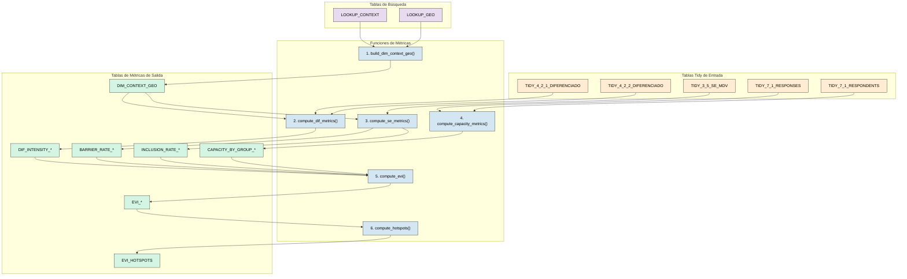
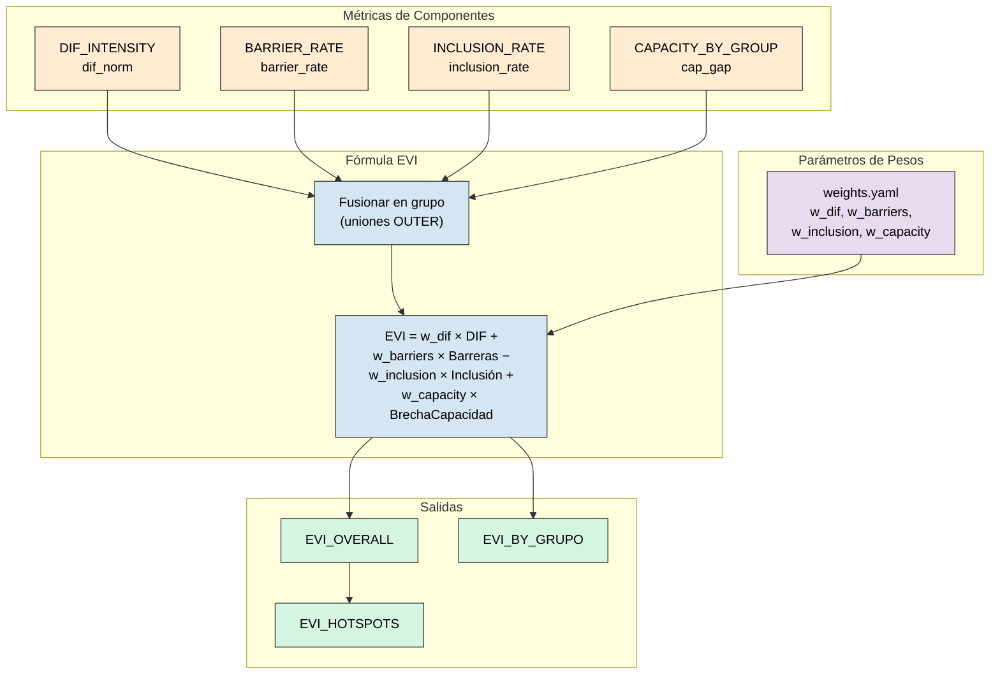

# Storyline 3: Auditoría de Equidad y Vulnerabilidad Diferenciada

Este documento proporciona una **auditoría detallada y neutral** del pipeline de análisis `storyline3/metrics.py`. Lista cada función, sus tablas de entrada, las columnas que utiliza y las uniones (joins) que realiza.

---

## Orquestación: `process_metrics()`

Esta es la función principal (línea 42). Llama a las siguientes funciones en orden:

1.  `build_dim_context_geo()` -> `DIM_CONTEXT_GEO`
    *Construye la tabla de dimensión geográfica vinculando contextos con sus metadatos geográficos. Esta es la base sobre la cual se anclan todas las demás métricas, permitiendo agregar resultados por territorio.*

2.  `compute_dif_metrics()` -> `DIF_INTENSITY_*`, `DIF_EVIDENCE_*`
    *Calcula la intensidad de impactos diferenciados por grupos vulnerables (mujeres, jóvenes, indígenas, etc.) analizando las columnas de impacto diferenciado de las hojas 4.2.1 y 4.2.2. Cuenta la frecuencia de menciones de cada grupo para determinar quiénes son reconocidos como especialmente afectados.*

3.  `compute_se_metrics()` -> `SE_ACCESS_*`, `BARRIER_RATE_*`, `INCLUSION_RATE_*`
    *Analiza barreras de acceso e indicadores de inclusión desde la hoja 3.5 SE-MdV. Calcula tasas: qué proporción de registros reporta barreras y qué proporción reporta mecanismos de inclusión. Las barreras aumentan vulnerabilidad; la inclusión la reduce.*

4.  `compute_capacity_metrics()` -> `CAPACITY_BY_GROUP_*`
    *Calcula brechas de capacidad adaptativa desagregadas por grupo demográfico usando las encuestas de la hoja 7.1. A diferencia de Storyline 1 que agrupa por MdV, aquí se agrupa por grupo (mujeres, jóvenes, etc.) para detectar disparidades sistemáticas.*

5.  `compute_evi()` -> `EVI_OVERALL`, `EVI_BY_GRUPO`
    *Calcula el Índice de Vulnerabilidad Equitativa (EVI) combinando los componentes anteriores con una suma ponderada: EVI = DIF + Barreras - Inclusión + BrechaCapacidad. La inclusión tiene signo negativo porque reduce vulnerabilidad. Grupos con alto EVI requieren intervenciones de equidad.*

6.  `compute_hotspots()` -> `EVI_HOTSPOTS`
    *Identifica "puntos calientes" filtrando registros donde el EVI supera un umbral crítico (configurable). Estos hotspots son combinaciones grupo × territorio que requieren atención prioritaria e inmediata.*

### Diagrama de Flujo de Orquestación



---

## Función 1: `build_dim_context_geo()` (Línea 32)

**Propósito:** Construye una tabla de dimensión uniendo las tablas de búsqueda de Contexto y Geografía.

### Explicación del Razonamiento

Igual que en Storylines 1 y 2, esta función crea el "esqueleto" geográfico. Ver explicación detallada en Storyline 1, Función 1.

| Tabla de Entrada | Columna(s) Usada(s) | Tipo de Unión |
|:---|:---|:---|
| `LOOKUP_CONTEXT` | `geo_id` | LEFT (origen) |
| `LOOKUP_GEO` | `geo_id` | LEFT (destino) |

**Columnas de Salida:** `context_id`, `grupo`, `paisaje`, `admin0`, `fecha_iso`.

---

## Función 2: `compute_dif_metrics()` (Línea 64)

**Propósito:** Calcula la intensidad de impactos diferenciados por grupo vulnerable.

### Explicación del Razonamiento

Esta función responde a la pregunta: **"¿Quiénes son afectados de manera diferenciada?"**

1. **¿Qué son los impactos diferenciados?**
   - Cuando una amenaza afecta **desproporcionadamente** a ciertos grupos (mujeres, jóvenes, pueblos indígenas, adultos mayores, personas con discapacidad).
   - Las tablas DIFERENCIADO contienen menciones cualitativas de "¿A quién afecta más esta amenaza?"

2. **¿Por qué unir dos tablas DIFERENCIADO?**
   - `TIDY_4_2_1_DIFERENCIADO`: Impactos diferenciados sobre **medios de vida**.
   - `TIDY_4_2_2_DIFERENCIADO`: Impactos diferenciados sobre **servicios ecosistémicos**.
   - La unión captura el panorama completo de vulnerabilidad diferenciada.

3. **¿Cómo se mide la intensidad?**
   - Se cuenta la **frecuencia de menciones** de cada grupo vulnerable.
   - Más menciones = mayor reconocimiento de que ese grupo es especialmente afectado.
   - La frecuencia se normaliza para comparación.

4. **¿Qué limitaciones tiene este enfoque?**
   - Depende de lo que las comunidades **reportaron**. Grupos invisibilizados pueden estar sub-representados.
   - Por eso el EVI también incorpora otras fuentes (encuestas, barreras de acceso).

| Tabla de Entrada | Columnas Candidatas |
|:---|:---|
| `TIDY_4_2_1_DIFERENCIADO` | `grupo_diferenciado`, `notas_dif` |
| `TIDY_4_2_2_DIFERENCIADO` | `grupo_diferenciado`, `notas_dif` |
| `DIM_CONTEXT_GEO` | `context_id`, `grupo` |

**Cálculos Internos:**
1.  **Unión** de ambas tablas DIFERENCIADO.
2.  Parsear columna `grupo_diferenciado` para menciones de grupos (Mujeres, Jóvenes, Indígenas, etc.).
3.  `groupby([grupo_diferenciado])` -> `count()` -> `dif_count`.
4.  `frequency_table()` -> intensidad normalizada.

**Salida:** `DIF_INTENSITY_OVERALL`, `DIF_INTENSITY_BY_GRUPO`, `DIF_EVIDENCE_*`.

---

## Función 3: `compute_se_metrics()` (Línea 121)

**Propósito:** Calcula tasas de barreras de acceso e inclusión desde datos de servicios-MdV.

### Explicación del Razonamiento

Esta función responde a la pregunta: **"¿Existen barreras estructurales que afectan el acceso a servicios?"**

1. **¿Qué son las barreras de acceso?**
   - Obstáculos que impiden o dificultan que ciertos grupos accedan a servicios ecosistémicos.
   - Ejemplos: distancia, costo, normas sociales, falta de información, discriminación.

2. **¿Qué es la inclusión?**
   - Medidas o mecanismos que **facilitan** el acceso de grupos vulnerables.
   - Ejemplos: cuotas, programas específicos, subsidios focalizados.

3. **¿De dónde vienen estos datos?**
   - La tabla `TIDY_3_5_SE_MDV` tiene columnas cualitativas (`barreras_acceso`, `inclusion`) con texto libre.
   - Se analiza si el campo está lleno (hay alguna barrera/mecanismo reportado) o vacío.

4. **¿Por qué calcular tasas en lugar de conteos?**
   - La **tasa** (proporción) permite comparar entre paisajes o grupos con diferente número de registros.
   - `barrier_rate = registros_con_barrera / total_registros`.

5. **¿Cómo interactúan barreras e inclusión en el EVI?**
   - Barreras **aumentan** vulnerabilidad.
   - Inclusión **reduce** vulnerabilidad.
   - En la fórmula del EVI, inclusión tiene peso negativo.

| Tabla de Entrada | Columnas Candidatas |
|:---|:---|
| `TIDY_3_5_SE_MDV` | `barreras_acceso`, `inclusion`, columnas de `acceso` |
| `DIM_CONTEXT_GEO` | `context_id`, `grupo` |

**Cálculos Internos:**
1.  Parsear `barreras_acceso` para texto no vacío -> `has_barrier`.
2.  Parsear `inclusion` para texto no vacío -> `has_inclusion`.
3.  `barrier_rate = count(has_barrier) / total_registros`.
4.  `inclusion_rate = count(has_inclusion) / total_registros`.

**Función interna calc_rates() (Línea 145):**
```python
def calc_rates(sub_df):
    barrier_rate = sub_df["has_barrier"].mean()
    inclusion_rate = sub_df["has_inclusion"].mean()
    return barrier_rate, inclusion_rate
```

**Salida:** `BARRIER_RATE_OVERALL`, `BARRIER_RATE_BY_GRUPO`, `INCLUSION_RATE_OVERALL`, `INCLUSION_RATE_BY_GRUPO`.

---

## Función 4: `compute_capacity_metrics()` (Línea 160)

**Propósito:** Calcula brechas de capacidad filtradas por grupo demográfico.

### Explicación del Razonamiento

Esta función responde a la pregunta: **"¿Tienen los grupos vulnerables menor capacidad adaptativa?"**

1. **¿Cuál es la diferencia con Storyline 1?**
   - Storyline 1 calcula capacidad por **medio de vida**.
   - Storyline 3 calcula capacidad por **grupo demográfico** (mujeres, jóvenes, etc.).
   - Esto permite identificar si ciertos grupos tienen sistemáticamente menor capacidad.

2. **¿Cómo se filtra por grupo?**
   - La tabla `TIDY_7_1_RESPONDENTS` tiene una columna `grupo_demografico` que identifica a qué grupo pertenece cada encuestado.
   - Se filtran respuestas por grupo y se calcula el promedio.

3. **¿Por qué usar grupos objetivo (target_groups)?**
   - No todos los grupos demográficos son igualmente vulnerables.
   - Los parámetros YAML definen cuáles grupos analizar (típicamente: mujeres, jóvenes, indígenas, afrodescendientes, adultos mayores, personas con discapacidad).

4. **¿Qué significa una brecha de capacidad diferenciada?**
   - Si las mujeres tienen `capacity_gap = 0.6` y los hombres tienen `0.3`, las mujeres tienen el doble de brecha.
   - Esto indica necesidad de intervenciones **focalizadas en género**.

| Tabla de Entrada | Columnas Candidatas |
|:---|:---|
| `TIDY_7_1_RESPONDENTS` | `respondent_id`, `grupo_demografico` |
| `TIDY_7_1_RESPONSES` | `respondent_id`, `response_numeric` |
| Parámetros YAML | `target_groups` (lista de grupos a analizar) |

**Cálculos Internos:**
1.  Unir respuestas con encuestados.
2.  Filtrar por `grupo_demografico` que coincida con grupos objetivo.
3.  `groupby([grupo_demografico])` -> `mean(response_numeric)` -> `capacity_avg`.
4.  `capacity_gap = 1 - capacity_avg`.

**Unión:**
```python
df = tidy_responses.merge(tidy_respondents, on="respondent_id", how="left")
```

**Salida:** `CAPACITY_BY_GROUP_OVERALL`, `CAPACITY_BY_GROUP_DETAIL`.

---

## Función 5: `compute_evi()` (Línea 224)

**Propósito:** Calcula el Índice de Vulnerabilidad Equitativa (EVI) desde métricas de componentes.

### Explicación del Razonamiento

Esta es la **función culminante** de Storyline 3. Responde a la pregunta: **"¿Cuáles grupos enfrentan mayor vulnerabilidad sistémica?"**

1. **¿Qué componentes integra el EVI?**
   - **Intensidad diferenciada (DIF)**: Cuánto se menciona al grupo como afectado.
   - **Tasa de barreras**: Proporción de servicios con barreras de acceso.
   - **Tasa de inclusión**: Proporción de servicios con mecanismos de inclusión.
   - **Brecha de capacidad**: Qué tan baja es la capacidad adaptativa del grupo.

2. **¿Por qué la inclusión tiene signo negativo?**
   - Los otros componentes **aumentan** vulnerabilidad: más menciones diferenciadas, más barreras, mayor brecha = más vulnerable.
   - La inclusión **reduce** vulnerabilidad: más mecanismos de inclusión = menos vulnerable.
   - Por eso en la fórmula: `- w_inclusion * inclusion_rate`.

3. **Fórmula del EVI:**
   ```python
   EVI = w_dif * dif_norm + w_barriers * barrier_rate - w_inclusion * inclusion_rate + w_capacity * cap_gap
   ```

4. **¿Cómo usar el EVI?**
   - Grupos con alto EVI son candidatos para **intervenciones de equidad**.
   - Comparar EVI entre paisajes identifica dónde las disparidades son más agudas.
   - Descomponer el EVI en sus componentes muestra **qué tipo de intervención** se necesita (capacitación, reducción de barreras, mecanismos de inclusión).

5. **¿Cómo se unen los componentes?**
   - Cada componente está a nivel de `grupo` (grupo de trabajo territorial).
   - Se fusionan por OUTER JOIN para no perder registros si un componente falta.

| Tabla de Entrada | Columna(s) Usada(s) |
|:---|:---|
| `DIF_INTENSITY_*` | `dif_norm` (intensidad de impactos diferenciados) |
| `BARRIER_RATE_*` | `barrier_rate` |
| `INCLUSION_RATE_*` | `inclusion_rate` |
| `CAPACITY_BY_GROUP_*` | `cap_gap` |
| Parámetros YAML | `w_dif`, `w_barriers`, `w_inclusion`, `w_capacity` |

**Uniones:** Fusiona todos los dataframes de componentes en la clave `grupo`.

**Salida:** `EVI_OVERALL`, `EVI_BY_GRUPO`.

---

## Función 6: `compute_hotspots()` (Línea 286)

**Propósito:** Identifica puntos calientes de alta vulnerabilidad.

### Explicación del Razonamiento

Esta función responde a la pregunta: **"¿Dónde están las situaciones más críticas?"**

1. **¿Qué es un hotspot?**
   - Un registro (grupo demográfico × paisaje) donde el EVI supera un umbral crítico.
   - Los hotspots son candidatos para **intervención prioritaria**.

2. **¿Cómo se define el umbral?**
   - Típicamente desde parámetros YAML (`hotspot_threshold`).
   - Puede ser absoluto (ej: EVI > 0.7) o relativo (ej: top 20%).

3. **¿Qué hacer con los hotspots identificados?**
   - Focalizar recursos en esas combinaciones grupo × paisaje.
   - Profundizar el diagnóstico cualitativo.
   - Diseñar intervenciones específicas.

| Tabla de Entrada | Columna(s) Usada(s) |
|:---|:---|
| `EVI_OVERALL` | `evi_score` |
| Parámetros YAML | `hotspot_threshold` |

**Lógica:**
```python
hotspots = evi_df[evi_df["evi_score"] >= threshold]
```

**Salida:** `EVI_HOTSPOTS`.

---

## Resumen de Todas las Uniones

| Función | Unión # | Tabla Izquierda | Tabla Derecha | Clave(s) de Unión | Tipo de Unión |
|:---|:---|:---|:---|:---|:---|
| `build_dim_context_geo` | 1 | `LOOKUP_CONTEXT` | `LOOKUP_GEO` | `geo_id` | LEFT |
| `compute_dif_metrics` | 1 | df DIF | `DIM_CONTEXT_GEO` | `context_id` | LEFT |
| `compute_se_metrics` | 1 | df SE_MDV | `DIM_CONTEXT_GEO` | `context_id` | LEFT |
| `compute_capacity_metrics` | 1 | `TIDY_7_1_RESPONSES` | `TIDY_7_1_RESPONDENTS` | `respondent_id` | LEFT |
| `compute_evi` | 1 | df DIF | df Barreras | `grupo` | OUTER |
| `compute_evi` | 2 | df Fusionado | df Inclusión | `grupo` | OUTER |
| `compute_evi` | 3 | df Fusionado | df Capacidad | `grupo` | OUTER |

---

## Flujo de Cálculo del EVI



---

## Grupos Vulnerables Analizados

Los siguientes grupos demográficos se analizan típicamente en Storyline 3:

| Clave del Grupo | Nombre en Español | Nombre en Inglés |
|:---|:---|:---|
| `mujeres` | Mujeres | Women |
| `jovenes` | Jóvenes | Youth |
| `indigenas` | Pueblos Indígenas | Indigenous Peoples |
| `afrodesc` | Afrodescendientes | Afro-descendants |
| `adultos_mayores` | Adultos Mayores | Elderly |
| `discapacidad` | Personas con Discapacidad | People with Disabilities |

> [!IMPORTANT]
> La identificación de estos grupos depende de cómo fueron reportados en los talleres participativos. Grupos no mencionados pueden estar invisible-zados en los datos.
