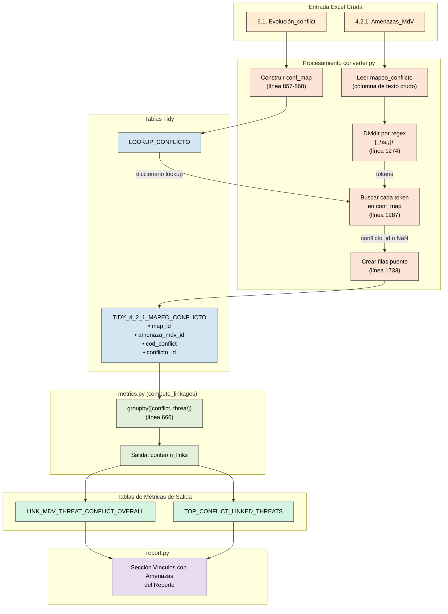

# Storyline 4: Auditoría de Factibilidad y Gobernanza

Este documento proporciona una **auditoría detallada y neutral** del pipeline de análisis `storyline4/metrics.py`. Lista cada función, sus tablas de entrada, las columnas que utiliza y las uniones (joins) que realiza.

---

## Orquestación: `process_metrics()`

Esta es la función principal (línea 788). Llama a las siguientes funciones en orden:

1.  `build_dim_context_geo()` -> `DIM_CONTEXT_GEO`
    *Construye la tabla de dimensión geográfica vinculando contextos con sus metadatos geográficos. Esta es la base sobre la cual se anclan todas las demás métricas, permitiendo agregar resultados por territorio.*

2.  `compute_actors_snapshot()` -> `ACTORS_OVERALL`, `ACTORS_BY_GRUPO`
    *Genera un censo de actores clave con sus atributos de poder e interés desde la hoja 5.1. Estos son los ejes del análisis clásico de stakeholders: actores con alto poder + alto interés son aliados estratégicos; alto poder + bajo interés requieren estrategias de involucramiento.*

3.  `compute_actor_relations()` -> `ACTOR_CENTRALITY_*`, `DYADS_*`
    *Analiza la red de relaciones entre actores desde la hoja 5.1 Relaciones. Calcula métricas de centralidad (grado de entrada y salida) para identificar actores "puente" o "hub". También genera tabla DYADS con todos los pares de actores y sus tipos de relación (colaboración, conflicto, etc.).*

4.  `compute_dialogue_spaces()` -> `DIALOGUE_SPACES_*`, `DIALOGUE_PARTICIPATION_*`, `ACTOR_IN_SPACES_*`
    *Analiza espacios de diálogo y gobernanza desde la hoja 5.2. Cuenta cuántos espacios existen, cuántos actores participan en cada uno, y qué tan diversa es la participación. Más espacios y mayor participación indican mejor gobernanza territorial.*

5.  `compute_conflicts_profile()` -> `CONFLICTS_*`, `CONFLICT_TIMELINE_*`, `CONFLICT_ACTORS_*`
    *Procesa eventos de conflicto desde la hoja 6.1, su evolución temporal (tendencias año a año) y los actores involucrados (hoja 6.2). Alto historial de conflicto reduce la factibilidad de implementar proyectos.*

6.  `compute_linkages()` -> `LINK_*` tables
    *Vincula amenazas con eventos de conflicto usando la columna mapeo_conflicto de las hojas 4.2.1 y 4.2.2. Esto identifica retroalimentaciones: una amenaza puede exacerbar conflictos, que a su vez reducen capacidad adaptativa.*

7.  `compute_feasibility_index()` -> `FEASIBILITY_OVERALL`, `FEASIBILITY_BY_GRUPO`
    *Calcula el índice final de factibilidad combinando: fortaleza de red (centralidad de colaboración), cobertura de diálogo (participación en espacios) y riesgo de conflicto (invirtido: menos conflicto = más factibilidad). Territorios con alta factibilidad son candidatos para proyectos piloto.*

### Diagrama de Flujo de Orquestación

```mermaid
graph TD
    subgraph Lookups ["Tablas de Búsqueda"]
        LK_CTX["LOOKUP_CONTEXT"]
        LK_GEO["LOOKUP_GEO"]
        LK_ACT["LOOKUP_ACTOR"]
        LK_CON["LOOKUP_CONFLICTO"]
    end

    subgraph Raw_Data ["Tablas Tidy de Entrada"]
        T_ACT["TIDY_5_1_ACTORES"]
        T_REL["TIDY_5_1_RELACIONES"]
        T_DIA["TIDY_5_2_DIALOGO"]
        T_DIA_ACT["TIDY_5_2_DIALOGO_ACTOR"]
        T_EVT["TIDY_6_1_CONFLICT_EVENTS"]
        T_CA["TIDY_6_2_CONFLICTO_ACTOR"]
        T_MAP1["TIDY_4_2_1_MAPEO_CONFLICTO"]
        T_MAP2["TIDY_4_2_2_MAPEO_CONFLICTO"]
    end

    subgraph Functions ["Funciones de Métricas"]
        F1["1. build_dim_context_geo()"]
        F2["2. compute_actors_snapshot()"]
        F3["3. compute_actor_relations()"]
        F4["4. compute_dialogue_spaces()"]
        F5["5. compute_conflicts_profile()"]
        F6["6. compute_linkages()"]
        F7["7. compute_feasibility_index()"]
    end

    subgraph Outputs ["Tablas de Métricas de Salida"]
        O_DIM["DIM_CONTEXT_GEO"]
        O_ACT["ACTORS_*"]
        O_CEN["ACTOR_CENTRALITY_*"]
        O_DYA["DYADS_*"]
        O_SPA["DIALOGUE_SPACES_*"]
        O_PAR["DIALOGUE_PARTICIPATION_*"]
        O_CON["CONFLICTS_*"]
        O_TIM["CONFLICT_TIMELINE_*"]
        O_LNK["LINK_*_THREAT_CONFLICT"]
        O_FEA["FEASIBILITY_*"]
    end

    LK_CTX --> F1
    LK_GEO --> F1
    F1 --> O_DIM

    T_ACT --> F2
    F2 --> O_ACT

    T_REL --> F3
    LK_ACT --> F3
    F3 --> O_CEN
    F3 --> O_DYA

    T_DIA --> F4
    T_DIA_ACT --> F4
    LK_ACT --> F4
    F4 --> O_SPA
    F4 --> O_PAR

    T_EVT --> F5
    T_CA --> F5
    LK_CON --> F5
    LK_ACT --> F5
    F5 --> O_CON
    F5 --> O_TIM

    T_MAP1 --> F6
    T_MAP2 --> F6
    F6 --> O_LNK

    O_CEN --> F7
    O_PAR --> F7
    O_TIM --> F7
    F7 --> O_FEA

    classDef lookup fill:#e8daef,stroke:#333,stroke-width:1px,color:black;
    classDef raw fill:#ffecd2,stroke:#333,stroke-width:1px,color:black;
    classDef func fill:#d4e6f1,stroke:#333,stroke-width:1px,color:black;
    classDef output fill:#d5f5e3,stroke:#333,stroke-width:1px,color:black;

    class LK_CTX,LK_GEO,LK_ACT,LK_CON lookup;
    class T_ACT,T_REL,T_DIA,T_DIA_ACT,T_EVT,T_CA,T_MAP1,T_MAP2 raw;
    class F1,F2,F3,F4,F5,F6,F7 func;
    class O_DIM,O_ACT,O_CEN,O_DYA,O_SPA,O_PAR,O_CON,O_TIM,O_LNK,O_FEA output;
```



---

## Función 1: `build_dim_context_geo()` (Línea 65)

**Propósito:** Construye una tabla de dimensión uniendo las tablas de búsqueda de Contexto y Geografía.

### Explicación del Razonamiento

Esta función es el **primer paso crítico** del pipeline porque establece el "esqueleto" geográfico que vincula todos los datos posteriores.

1. **¿Por qué se necesitan dos tablas?**
   - `LOOKUP_CONTEXT` contiene los **identificadores únicos de contexto** (`context_id`) que representan cada combinación única de país-paisaje-grupo-fecha.
   - `LOOKUP_GEO` contiene los **atributos geográficos detallados** (nombre del país `admin0`, nombre del paisaje, región, etc.).

2. **¿Por qué una unión LEFT?**
   - Se usa LEFT JOIN para garantizar que **todos los contextos se conserven**, incluso si por algún error de datos falta información geográfica.

3. **¿Cuál es el resultado?**
   - La tabla `DIM_CONTEXT_GEO` es una **tabla de dimensión** en el sentido de modelado dimensional (star schema).

4. **¿Por qué es la primera función?**
   - Las funciones siguientes necesitan la tabla `DIM_CONTEXT_GEO` para adjuntar contexto geográfico a sus resultados.

| Tabla de Entrada | Columna(s) Usada(s) | Tipo de Unión |
|:---|:---|:---|
| `LOOKUP_CONTEXT` | `geo_id` (o `id_geo`) | LEFT (origen) |
| `LOOKUP_GEO` | `geo_id` (o `id_geo`) | LEFT (destino) |

**Unión:**
```python
result = ctx.merge(geo, left_on=ctx_geo_col, right_on=geo_geo_col, how="left")
```

**Columnas de Salida:** `context_id`, `grupo`, `paisaje`, `admin0`, `fecha_iso`.

---

## Función 2: `compute_actors_snapshot()` (Línea 103)

**Propósito:** Agrega estadísticas de actores (Poder, Interés).

### Explicación del Razonamiento

Esta función responde a la pregunta: **"¿Quiénes son los actores clave y cuáles son sus características?"**

1. **¿Qué es un actor en este contexto?**
   - Un actor es cualquier individuo, organización o institución que tiene influencia o interés en el territorio.
   - Ejemplos: gobierno local, ONG, cooperativa agrícola, empresa privada, líder comunitario.

2. **¿Qué significan Poder e Interés?**
   - **Poder**: Capacidad del actor para influir en decisiones (recursos, autoridad, legitimidad).
   - **Interés**: Grado de motivación del actor para participar en el tema.
   - Estos son los ejes del clásico **análisis de stakeholders**.

3. **¿Por qué agregar por tipo de actor?**
   - Permite ver patrones: ¿Los actores gubernamentales tienen más poder pero menos interés? ¿Las ONG tienen alto interés pero bajo poder?

4. **¿Cómo se usa esta información?**
   - Actores con alto poder + alto interés son **aliados clave**.
   - Actores con alto poder + bajo interés requieren **estrategias de involucramiento**.
   - Actores con bajo poder + alto interés pueden ser **beneficiarios prioritarios**.

| Tabla de Entrada | Columnas Candidatas |
|:---|:---|
| `TIDY_5_1_ACTORES` | `actor_id`, `nombre_actor`, `tipo_actor`, `poder`, `interes`, `grupo` |

**Cálculos Internos:**
- Agregaciones por tipo de actor y por grupo.
- No hay uniones; solo usa `groupby()`.

**Salida:** `ACTORS_OVERALL`, `ACTORS_BY_GRUPO`.

---

## Función 3: `compute_actor_relations()` (Línea 201)

**Propósito:** Calcula centralidad de red (grado de entrada, grado de salida) desde relaciones entre actores.

### Explicación del Razonamiento

Esta función responde a la pregunta: **"¿Cómo están conectados los actores entre sí?"**

1. **¿Qué son las relaciones entre actores?**
   - Vínculos reportados entre pares de actores.
   - Tipos típicos: colaboración, conflicto, dependencia, coordinación.
   - Cada relación tiene un origen (`actor_id`) y un destino (`otro_actor_id`).

2. **¿Qué es la centralidad?**
   - **Out-degree (grado de salida)**: Cuántas relaciones origina el actor. Actores con alto out-degree son **proactivos/influyentes**.
   - **In-degree (grado de entrada)**: Cuántas relaciones recibe el actor. Actores con alto in-degree son **referentes/centrales**.

3. **¿Por qué separar por tipo de relación?**
   - Un actor puede tener muchas relaciones de colaboración pero también de conflicto.
   - Se calcula `out_degree_colabora` y `out_degree_conflicto` por separado.

4. **¿Qué son los DYADS?**
   - Pares de actores con sus tipos de relación.
   - Útiles para visualizar la red de gobernanza.

5. **¿Cómo se usa en el índice de factibilidad?**
   - Alta colaboración = alta fortaleza de red = mayor factibilidad.
   - Alto conflicto entre actores = menor factibilidad.

| Tabla de Entrada | Columnas Candidatas |
|:---|:---|
| `TIDY_5_1_RELACIONES` | `actor_id`, `otro_actor_id`, `tipo_relacion` |
| `LOOKUP_ACTOR` | `actor_id`, `nombre_actor` |

**Cálculos Internos:**
1.  `groupby([actor_id, rel_type_norm])` -> `out_degree`.
2.  `groupby([other_actor_col, rel_type_norm])` -> `in_degree`.

**Unión 1 (Línea 270):** Fusionar in-degree en out-degree.
```python
degree_df = degree_df.merge(in_degree, on="actor_id", how="outer")
```

**Unión 2 (Línea 284):** Enriquecer con nombres de actores.
```python
degree_df = degree_df.merge(actor_map, on="actor_id", how="left")
```

**Salida:** `ACTOR_CENTRALITY_OVERALL`, `ACTOR_CENTRALITY_BY_GRUPO`, `DYADS_OVERALL`, `DYADS_BY_GRUPO`.

---

## Función 4: `compute_dialogue_spaces()` (Línea 327)

**Propósito:** Calcula participación en espacios de diálogo.

### Explicación del Razonamiento

Esta función responde a la pregunta: **"¿Existen espacios de gobernanza donde los actores pueden dialogar?"**

1. **¿Qué son los espacios de diálogo?**
   - Foros, mesas, comités o cualquier mecanismo donde múltiples actores interactúan para tomar decisiones.
   - Ejemplos: mesa de agua, comité de cuenca, asamblea comunitaria.

2. **¿Por qué importan para la factibilidad?**
   - Más espacios de diálogo = más oportunidades para resolver conflictos y coordinar acciones.
   - Mayor participación de actores diversos = gobernanza más inclusiva.

3. **¿Qué métricas se calculan?**
   - **Número de espacios** por tipo y alcance.
   - **Participación promedio** (cuántos actores por espacio).
   - **Diversidad de actores** en cada espacio.

4. **¿De dónde vienen los datos?**
   - `TIDY_5_2_DIALOGO`: Catálogo de espacios de diálogo.
   - `TIDY_5_2_DIALOGO_ACTOR`: Mapeo de qué actores participan en qué espacios.

| Tabla de Entrada | Columnas Candidatas |
|:---|:---|
| `TIDY_5_2_DIALOGO` | `dialogo_id`, `nombre_espacio`, `tipo_espacio`, `alcance` |
| `TIDY_5_2_DIALOGO_ACTOR` | `dialogo_id`, `actor_id` |

**Unión 1 (Línea 393):** Obtener nombres de diálogo para tabla de participación.
```python
participation = participation.merge(names_map, left_on=da_dialogo_id, right_on=dialogo_id_col, how="left")
```

**Unión 2 (Línea 417):** Enriquecer conteo de actores con nombres.
```python
actor_spaces = actor_spaces.merge(actor_names_map, left_on=da_actor_id, right_on=la_id, how="left")
```

**Salida:** `DIALOGUE_SPACES_OVERALL`, `DIALOGUE_SPACES_BY_GRUPO`, `DIALOGUE_PARTICIPATION_OVERALL`, `ACTOR_IN_SPACES_OVERALL`.

---

## Función 5: `compute_conflicts_profile()` (Línea 447)

**Propósito:** Procesa eventos de conflicto y sus atributos.

### Explicación del Razonamiento

Esta función responde a la pregunta: **"¿Cuál es el historial y perfil de conflictos en el territorio?"**

1. **¿Qué es un evento de conflicto?**
   - Cualquier episodio de tensión, disputa o confrontación relacionado con recursos naturales, territorio o medios de vida.
   - Cada evento tiene: tipo, nivel de severidad, año, incidencia.

2. **¿Por qué analizar conflictos históricos?**
   - Territorios con alto historial de conflicto tienen **menor factibilidad** para implementar proyectos.
   - Entender los patrones ayuda a diseñar **estrategias de mitigación**.

3. **¿Qué métricas se calculan?**
   - **Frecuencia de eventos** por año y tipo.
   - **Nivel de conflicto** (intensidad/severidad).
   - **Actores involucrados** en cada conflicto.

4. **¿Cómo alimenta al índice de factibilidad?**
   - Mayor número de eventos + mayor severidad = mayor riesgo de conflicto = menor factibilidad.
   - El riesgo de conflicto **resta** puntos al índice final.

| Tabla de Entrada | Columnas Candidatas |
|:---|:---|
| `TIDY_6_1_CONFLICT_EVENTS` | `conflicto_id`, `tipo_conflicto`, `nivel_conflicto`, `anio`, `incidencia` |
| `TIDY_6_2_CONFLICTO_ACTOR` | `conflicto_id`, `actor_id` |
| `LOOKUP_CONFLICTO` | `conflicto_id`, descripción |
| `LOOKUP_ACTOR` | `actor_id`, `nombre_actor` |

**Unión 1 (Línea 551):** Enriquecer conflictos con descripción.
```python
conflicts_overall = conflicts_overall.merge(conflict_map, on=conflict_code_col, how="left")
```

**Unión 2 (Línea 615):** Enriquecer conflict_actors con descripción.
```python
conflict_actors = conflict_actors.merge(c_map, on=ca_conflict_col, how="left")
```

**Unión 3 (Línea 626):** Enriquecer conflict_actors con nombres de actores.
```python
conflict_actors = conflict_actors.merge(a_map, on=ca_actor_col, how="left")
```

**Salida:** `CONFLICTS_OVERALL`, `CONFLICTS_BY_GRUPO`, `CONFLICT_TIMELINE_OVERALL`, `CONFLICT_TIMELINE_BY_GRUPO`, `CONFLICT_ACTORS_OVERALL`.

---

## Función 6: `compute_linkages()` (Línea 637)

**Propósito:** Vincula amenazas con eventos de conflicto.

### Explicación del Razonamiento

Esta función responde a la pregunta: **"¿Las amenazas climáticas/ambientales están relacionadas con conflictos sociales?"**

> [!IMPORTANT]
> Esta función lee las tablas "MAPEO_CONFLICTO" creadas por el converter.

1. **¿Qué es el mapeo de conflictos?**
   - En la evaluación de amenazas (4.2.1 y 4.2.2), los participantes pueden indicar si una amenaza está relacionada con conflictos específicos.
   - La columna `mapeo_conflicto` contiene identificadores de conflictos vinculados.

2. **¿Cómo funciona el procesamiento?**
   - El converter.py parsea la columna `mapeo_conflicto` (texto libre).
   - Extrae tokens y los busca en `LOOKUP_CONFLICTO`.
   - Si encuentra match, crea un vínculo amenaza-conflicto.

3. **¿Por qué el resultado puede estar vacío?**
   - Si `mapeo_conflicto` contiene códigos de zonas geográficas (no IDs de conflictos), la búsqueda no encuentra matches.
   - Esto es un **problema de datos**, no del código.

4. **¿Cómo usar estos vínculos?**
   - Identificar **ciclos de retroalimentación**: una amenaza puede exacerbar conflictos, que a su vez reducen capacidad adaptativa.
   - Diseñar intervenciones que aborden **simultáneamente** amenazas y conflictos.

| Tabla de Entrada | Columnas Candidatas |
|:---|:---|
| `TIDY_4_2_1_MAPEO_CONFLICTO` | `conflicto_id`, `amenaza_id` |
| `TIDY_4_2_2_MAPEO_CONFLICTO` | `conflicto_id`, `amenaza_id` |

**Cálculo Interno:** `groupby([conflict_col, threat_col])` -> `n_links`.

**Salida:** `LINK_MDV_THREAT_CONFLICT_OVERALL`, `LINK_SE_THREAT_CONFLICT_OVERALL`, `TOP_CONFLICT_LINKED_THREATS`.

---

## Función 7: `compute_feasibility_index()` (Línea 697)

**Propósito:** Calcula el índice final de factibilidad.

### Explicación del Razonamiento

Esta es la **función culminante** de Storyline 4. Responde a la pregunta: **"¿Qué tan viable es implementar intervenciones en este territorio?"**

1. **¿Qué componentes integra el índice de factibilidad?**
   - **Fortaleza de red de actores**: Basada en relaciones de colaboración (de Función 3).
   - **Cobertura de diálogo**: Basada en participación en espacios de gobernanza (de Función 4).
   - **Riesgo de conflicto**: Basado en eventos de conflicto (de Función 5).

2. **¿Cómo se combinan?**
   ```python
   feasibility_score = (
       w1 * actor_strength_norm +
       w2 * dialogue_norm +
       w3 * (1 - conflict_risk_norm)
   )
   ```
   - Colaboración y diálogo **suman**.
   - Conflicto **resta** (por eso se invierte: `1 - conflict_risk`).

3. **¿Por qué es una combinación aditiva?**
   - Simplicidad e interpretabilidad.
   - Permite descomponer el índice para ver qué factor contribuye más.

4. **¿Cómo usar el índice?**
   - Territorios con alta factibilidad son candidatos para **proyectos piloto**.
   - Territorios con baja factibilidad necesitan **trabajo previo de construcción de confianza**.
   - Comparar factibilidad entre grupos ayuda a asignar recursos.

| Tabla de Entrada | Columna(s) Usada(s) |
|:---|:---|
| `ACTOR_CENTRALITY_BY_GRUPO` | `out_degree_colabora` -> `actor_network_strength` |
| `DIALOGUE_PARTICIPATION_OVERALL` | `n_actors` -> `dialogue_coverage` |
| `CONFLICT_TIMELINE_BY_GRUPO` | `n_events` -> `conflict_events` |

**Uniones:** Ninguna. Recibe métricas ya calculadas como diccionarios.

**Fórmula (Línea 766):**
```python
feasibility_score = (
    w1 * actor_strength_norm +
    w2 * dialogue_norm +
    w3 * (1 - conflict_risk_norm)
)
```

**Salida:** `FEASIBILITY_BY_GRUPO`, `FEASIBILITY_OVERALL`.

---

## Resumen de Todas las Uniones

| Función | Unión # | Tabla Izquierda | Tabla Derecha | Clave(s) de Unión | Tipo de Unión |
|:---|:---|:---|:---|:---|:---|
| `build_dim_context_geo` | 1 | `LOOKUP_CONTEXT` | `LOOKUP_GEO` | `geo_id` | LEFT |
| `compute_actor_relations` | 1 | df out_degree | df in_degree | `actor_id` | OUTER |
| `compute_actor_relations` | 2 | df Centralidad | `LOOKUP_ACTOR` | `actor_id` | LEFT |
| `compute_dialogue_spaces` | 1 | df Participación | `TIDY_5_2_DIALOGO` | `dialogo_id` | LEFT |
| `compute_dialogue_spaces` | 2 | df Actor Spaces | `LOOKUP_ACTOR` | `actor_id` | LEFT |
| `compute_conflicts_profile` | 1 | df Conflicts | `LOOKUP_CONFLICTO` | `conflicto_id` | LEFT |
| `compute_conflicts_profile` | 2 | df Conflict Actors | `LOOKUP_CONFLICTO` | `conflicto_id` | LEFT |
| `compute_conflicts_profile` | 3 | df Conflict Actors | `LOOKUP_ACTOR` | `actor_id` | LEFT |
| `compute_linkages` | - | N/A | N/A | N/A | N/A |

---

## Apéndice A: Lógica del Converter para `TIDY_4_2_1_MAPEO_CONFLICTO`

**Archivo Fuente:** `pares_converter/app/converter.py` (Líneas 1271-1290)

**Propósito:** Parsea la columna `mapeo_conflicto` cruda de `4.2.1. Amenazas_MdV` e intenta vincular sus tokens con `LOOKUP_CONFLICTO`.

### Lógica Paso a Paso:

1.  **Entrada:** Columna `mapeo_conflicto` de `4.2.1. Amenazas_MdV`.
2.  **División:** El valor de texto se divide por `[_\\s,;]+` (guiones bajos, espacios, comas, punto y coma) en tokens individuales.
    ```python
    toks = re.split(r"[_\\s,;]+", str(val).strip())
    ```
3.  **Búsqueda:** Cada token se canoniza y se busca en `conf_map`, un diccionario construido desde `LOOKUP_CONFLICTO`. Si se encuentra, obtiene el `conflicto_id`.
    ```python
    "conflicto_id": conf_map.get(canonical_text(t2), np.nan)
    ```
4.  **Salida:** Una tabla puente `TIDY_4_2_1_MAPEO_CONFLICTO` con columnas:
    *   `map_id`: Hash único.
    *   `amenaza_mdv_id`: Vínculo a la fila amenaza-MDV.
    *   `cod_conflict`: El token crudo extraído.
    *   `conflicto_id`: El ID resuelto del lookup (o NaN si no se encontró).

### Cómo se Construye `conf_map`:

El `conf_map` se construye antes en `converter.py` (alrededor de línea 857-860) iterando sobre la hoja `6.1. Evolución_conflict` y mapeando cada `conflicto_id` a su forma textual canónica.

> [!IMPORTANT]
> Si `mapeo_conflicto` contiene **códigos de zona/mapa** (ej: "ZONE_A") en lugar de **IDs de eventos de conflicto** (ej: "C_2021_001"), entonces la búsqueda `conf_map.get()` retornará `NaN` para cada fila porque no se encontrará match en `LOOKUP_CONFLICTO`.

Esto explica por qué `TIDY_4_2_1_MAPEO_CONFLICTO` puede tener 0 filas incluso cuando la columna `mapeo_conflicto` tiene datos.

---

## Apéndice B: Cadena de Visualización para "Vínculos con Amenazas"

Esta sección traza cómo se genera la sección del reporte **"5. Vínculos con Amenazas"**.

### Diagrama de Flujo de Datos



### Resumen de Flujo de Datos

| Paso | Ubicación | Entrada | Salida |
|:---|:---|:---|:---|
| 1 | `converter.py:1274` | `mapeo_conflicto` (texto crudo) | Tokens (lista) |
| 2 | `converter.py:1287` | Token + `conf_map` | `conflicto_id` (o NaN) |
| 3 | `converter.py:1733` | Filas de tokens | `TIDY_4_2_1_MAPEO_CONFLICTO` |
| 4 | `metrics.py:666` | Tabla TIDY | `LINK_MDV_THREAT_CONFLICT_OVERALL` |
| 5 | `report.py` | Tabla LINK | Sección "Vínculos con Amenazas" |
