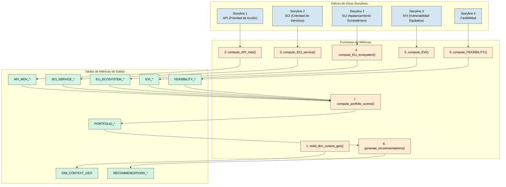
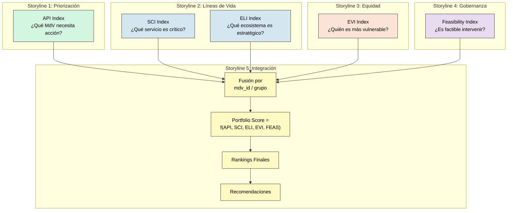

# Storyline 5: Auditoría de Diseño de Portafolio SbN

Este documento proporciona una **auditoría detallada y neutral** del pipeline de análisis `storyline5/metrics_local.py`. Lista cada función, sus tablas de entrada, las columnas que utiliza y las uniones (joins) que realiza.

---

## Orquestación: `compute_all_metrics()`

Esta es la función principal (línea 932). Integra resultados de las otras storylines para construir un portafolio priorizado de intervenciones basadas en naturaleza (SbN/NbS). Llama a las siguientes funciones en orden:

1.  `build_dim_context_geo()` -> `DIM_CONTEXT_GEO`
    *Construye la tabla de dimensión geográfica vinculando contextos con sus metadatos geográficos. Esta es la base sobre la cual se anclan todas las demás métricas, permitiendo agregar resultados por territorio.*

2.  `compute_API_mdv()` -> `API_MDV_*`
    *Importa el Índice de Prioridad de Acción (API) desde los resultados de Storyline 1. El API combina importancia del MdV + riesgo + brecha de capacidad. MdVs con alto API son candidatos prioritarios porque son importantes para la comunidad, altamente amenazados y con poca capacidad de adaptación.*

3.  `compute_SCI_service()` -> `SCI_SERVICE_*`
    *Importa el Índice de Criticidad de Servicios (SCI) desde Storyline 2. Vincula los servicios críticos con los MdVs que dependen de ellos usando la tabla TIDY_3_5_SE_MDV. Esto propaga la criticidad del servicio hacia los MdVs.*

4.  `compute_ELI_ecosystem()` -> `ELI_ECOSYSTEM_*`
    *Importa el Índice de Apalancamiento Ecosistémico (ELI) desde Storyline 2. Propaga el ELI hacia los MdVs a través de la cadena Ecosistema → Servicio → MdV. MdVs que dependen de ecosistemas con alto ELI se beneficiarían desproporcionadamente de intervenciones de conservación.*

5.  `compute_EVI()` -> `EVI_*`
    *Importa el Índice de Vulnerabilidad Equitativa (EVI) desde Storyline 3. El EVI indica qué grupos demográficos enfrentan mayor vulnerabilidad sistémica. Se usa para priorizar intervenciones que beneficien a los más vulnerables y evitar exacerbar desigualdades.*

6.  `compute_FEASIBILITY()` -> `FEASIBILITY_*`
    *Importa el Índice de Factibilidad desde Storyline 4. Un MdV puede ser muy prioritario pero si el territorio tiene baja factibilidad (conflictos, poca colaboración), la intervención puede fracasar. La factibilidad actúa como "filtro de realismo" multiplicando o ponderando la puntuación final.*

7.  `compute_portfolio_scores()` -> `PORTFOLIO_OVERALL`, `PORTFOLIO_BY_GRUPO`, `PORTFOLIO_TOP_*`
    *Combina todos los índices (API, SCI, ELI, EVI, Factibilidad) en una puntuación final de portafolio usando una suma ponderada. Los pesos son configurables para generar escenarios ("enfoque equidad" vs "enfoque ecosistemas"). MdVs con alto portfolio score son candidatos ideales para intervención SbN.*

8.  `generate_recommendations()` -> `RECOMMENDATIONS_*`
    *Genera recomendaciones textuales legibles usando plantillas. Inserta los nombres de MdVs, ecosistemas y servicios desde las tablas DIM para producir texto como "Se recomienda priorizar el MdV Ganadería bovina debido a su alto índice de prioridad y criticidad de servicios vinculados."*

### Diagrama de Flujo de Orquestación



---

## Función 1: `build_dim_context_geo()` (Línea 75)

**Propósito:** Construye una tabla de dimensión uniendo las tablas de búsqueda de Contexto y Geografía.

### Explicación del Razonamiento

Igual que en las otras Storylines, esta función crea el "esqueleto" geográfico. Ver explicación detallada en Storyline 1, Función 1.

| Tabla de Entrada | Columna(s) Usada(s) | Tipo de Unión |
|:---|:---|:---|
| `LOOKUP_CONTEXT` | `geo_id` | LEFT (origen) |
| `LOOKUP_GEO` | `geo_id` | LEFT (destino) |

**Columnas de Salida:** `context_id`, `grupo`, `paisaje`, `admin0`, `fecha_iso`.

---

## Función 2: `compute_API_mdv()` (Línea 143)

**Propósito:** Importa el Índice de Prioridad de Acción (API) desde Storyline 1.

### Explicación del Razonamiento

Esta función responde a la pregunta: **"¿Cuáles medios de vida son prioritarios según Storyline 1?"**

1. **¿Qué es el API?**
   - El **Índice de Prioridad de Acción** combina:
     - Importancia del MdV para la comunidad (prioridad).
     - Exposición a amenazas (riesgo).
     - Falta de recursos para adaptarse (brecha de capacidad).
   - MdVs con alto API necesitan intervención urgente.

2. **¿Por qué importar en lugar de recalcular?**
   - Storyline 5 es un **integrador**. No recalcula métricas, las recibe de otras storylines.
   - Esto evita duplicación de lógica y garantiza consistencia.

3. **¿Cómo se usa en el portafolio?**
   - El API alimenta la fórmula final del portafolio como el componente de "qué es importante".
   - Alto API = alta puntuación de portafolio.

| Tabla de Entrada | Columna(s) Usada(s) |
|:---|:---|
| Resultado de Storyline 1 | `API_BALANCED_OVERALL`, `API_BY_GRUPO` |

**Salida:** `API_MDV_OVERALL`, `API_MDV_BY_GRUPO`.

---

## Función 3: `compute_SCI_service()` (Línea 201)

**Propósito:** Importa el Índice de Criticidad de Servicios (SCI) desde Storyline 2.

### Explicación del Razonamiento

Esta función responde a la pregunta: **"¿Cuáles servicios ecosistémicos son más críticos?"**

1. **¿Qué es el SCI?**
   - El **Índice de Criticidad del Servicio** combina:
     - Número de usuarios del servicio.
     - Amplitud de MdVs que dependen del servicio.
     - Estacionalidad de disponibilidad.

2. **¿Por qué incluirlo en el portafolio?**
   - Intervenciones SbN que protejan servicios críticos tienen mayor impacto.
   - Un proyecto de restauración en una cuenca con alto SCI beneficia a más personas.

3. **¿Cómo vincula con medios de vida?**
   - La tabla `TIDY_3_5_SE_MDV` mapea servicios a MdVs.
   - Para cada MdV, se puede calcular el SCI promedio de los servicios que usa.

| Tabla de Entrada | Columna(s) Usada(s) |
|:---|:---|
| Resultado de Storyline 2 | `SCI_BALANCED_OVERALL`, `SCI_BY_GRUPO` |
| `TIDY_3_5_SE_MDV` | Vínculo SE-MdV |

**Salida:** `SCI_SERVICE_OVERALL`, `SCI_SERVICE_BY_GRUPO`.

---

## Función 4: `compute_ELI_ecosystem()` (Línea 267)

**Propósito:** Importa el Índice de Apalancamiento Ecosistémico (ELI) desde Storyline 2.

### Explicación del Razonamiento

Esta función responde a la pregunta: **"¿Cuáles ecosistemas ofrecen mayor 'retorno de inversión' para conservación?"**

1. **¿Qué es el ELI?**
   - El **Índice de Apalancamiento Ecosistémico** identifica ecosistemas que:
     - Soportan muchos servicios.
     - Esos servicios son críticos (alto SCI).
   - Invertir en proteger ecosistemas con alto ELI beneficia desproporcionadamente al sistema.

2. **¿Por qué incluirlo en el portafolio?**
   - Ayuda a priorizar **dónde** implementar intervenciones SbN.
   - Un proyecto en un ecosistema con alto ELI tiene efectos multiplicadores.

3. **¿Cómo vincular con MdVs?**
   - A través de la cadena: Ecosistema → Servicio → MdV.
   - Se propaga el ELI a los MdVs que dependen de ese ecosistema.

| Tabla de Entrada | Columna(s) Usada(s) |
|:---|:---|
| Resultado de Storyline 2 | `ELI_OVERALL`, `ELI_BY_GRUPO` |
| `TIDY_3_4_ECO_SE`, `TIDY_3_5_SE_MDV` | Cadena de vínculos |

**Salida:** `ELI_ECOSYSTEM_OVERALL`, `ELI_ECOSYSTEM_BY_GRUPO`.

---

## Función 5: `compute_EVI()` (Línea 332)

**Propósito:** Importa el Índice de Vulnerabilidad Equitativa (EVI) desde Storyline 3.

### Explicación del Razonamiento

Esta función responde a la pregunta: **"¿Cuáles grupos enfrentan mayor vulnerabilidad sistémica?"**

1. **¿Qué es el EVI?**
   - El **Índice de Vulnerabilidad Equitativa** combina:
     - Impactos diferenciados por grupo demográfico.
     - Barreras de acceso a servicios.
     - Mecanismos de inclusión (resta).
     - Brecha de capacidad adaptativa.

2. **¿Por qué incluirlo en el portafolio?**
   - El enfoque de equidad es crucial: intervenciones que no consideren grupos vulnerables pueden exacerbar desigualdades.
   - Alto EVI indica dónde focalizar esfuerzos de inclusión.

3. **¿Cómo afecta la puntuación de portafolio?**
   - MdVs asociados con grupos de alto EVI reciben puntuación adicional.
   - Esto prioriza intervenciones que beneficien a los más vulnerables.

| Tabla de Entrada | Columna(s) Usada(s) |
|:---|:---|
| Resultado de Storyline 3 | `EVI_OVERALL`, `EVI_BY_GRUPO` |

**Salida:** `EVI_OVERALL`, `EVI_BY_GRUPO`.

---

## Función 6: `compute_FEASIBILITY()` (Línea 396)

**Propósito:** Importa el Índice de Factibilidad desde Storyline 4.

### Explicación del Razonamiento

Esta función responde a la pregunta: **"¿Qué tan viable es implementar intervenciones en este territorio?"**

1. **¿Qué es el Índice de Factibilidad?**
   - Combina:
     - Fortaleza de red de actores (colaboración).
     - Cobertura de espacios de diálogo.
     - Riesgo de conflicto (resta).

2. **¿Por qué es crucial para el portafolio?**
   - Un MdV puede ser muy prioritario (alto API), pero si el territorio tiene baja factibilidad, la intervención puede fracasar.
   - La factibilidad es un **filtro de realismo**.

3. **¿Cómo afecta la fórmula?**
   - MdVs en territorios de alta factibilidad reciben puntuación más alta.
   - Alternativamente, puede usarse como umbral: solo mostrar MdVs donde factibilidad > 0.5.

| Tabla de Entrada | Columna(s) Usada(s) |
|:---|:---|
| Resultado de Storyline 4 | `FEASIBILITY_OVERALL`, `FEASIBILITY_BY_GRUPO` |

**Salida:** `FEASIBILITY_OVERALL`, `FEASIBILITY_BY_GRUPO`.

---

## Función 7: `compute_portfolio_scores()` (Línea 467)

**Propósito:** Combina todos los índices en una puntuación final de portafolio.

### Explicación del Razonamiento

Esta es la **función culminante** del pipeline completo de PARES. Responde a la pregunta: **"¿Dónde, en qué y cómo debemos invertir?"**

1. **¿Qué componentes integra el portafolio?**
   - **API**: Qué MdVs son prioritarios (demanda + riesgo + brecha).
   - **SCI**: Qué servicios ecosistémicos son críticos.
   - **ELI**: Qué ecosistemas ofrecen mayor apalancamiento.
   - **EVI**: Dónde hay mayor vulnerabilidad de grupos marginados.
   - **Factibilidad**: Dónde es más viable implementar.

2. **Fórmula del Portfolio Score:**
   ```python
   PORTFOLIO = (
       w_api * API_norm +
       w_sci * SCI_norm +
       w_eli * ELI_norm +
       w_evi * EVI_norm
   ) * (factibility_factor)
   ```
   Donde `factibility_factor` puede ser multiplicativo (0-1) o aditivo.

3. **¿Por qué una combinación ponderada?**
   - Diferentes proyectos/donantes pueden tener diferentes prioridades.
   - Los pesos son configurables vía YAML.
   - Se pueden generar múltiples escenarios (ej: "enfoque en equidad" vs "enfoque en ecosistemas").

4. **¿Qué significa un alto Portfolio Score?**
   - El MdV/territorio es:
     - Prioritario para la comunidad.
     - Dependiente de servicios críticos.
     - Vinculado a ecosistemas estratégicos.
     - Afecta a grupos vulnerables.
     - Es factible de intervenir.
   - Es un **candidato ideal** para intervención SbN.

| Tabla de Entrada | Columna(s) Usada(s) |
|:---|:---|
| `API_MDV_*` | `api_norm` |
| `SCI_SERVICE_*` | `sci_norm` |
| `ELI_ECOSYSTEM_*` | `eli_norm` |
| `EVI_*` | `evi_norm` |
| `FEASIBILITY_*` | `feasibility_norm` |
| Pesos YAML | `w_api`, `w_sci`, `w_eli`, `w_evi`, `w_feas` |

**Uniones:** Fusiona todos los dataframes de índices en la clave `mdv_id` o `grupo`.

**Salida:** `PORTFOLIO_OVERALL`, `PORTFOLIO_BY_GRUPO`, `PORTFOLIO_TOP_MDV`, `PORTFOLIO_TOP_ECOSYSTEM`, `PORTFOLIO_TOP_SERVICES`.

---

## Función 8: `generate_recommendations()` (Línea 589)

**Propósito:** Genera recomendaciones textuales basadas en rankings.

### Explicación del Razonamiento

Esta función responde a la pregunta: **"¿Cómo traducir los números en acciones concretas?"**

1. **¿Qué tipo de recomendaciones genera?**
   - Listado de MdVs prioritarios con justificación.
   - Ecosistemas sugeridos para intervención.
   - Servicios críticos a proteger.
   - Alertas sobre baja factibilidad o alta vulnerabilidad.

2. **¿Cómo construye el texto?**
   - Usa plantillas (templates) con variables.
   - Inserta los nombres de MdVs, ecosistemas, servicios desde las tablas DIM.
   - Puede generar en español e inglés.

3. **¿Para qué se usan las recomendaciones?**
   - Alimentan el reporte final.
   - Sirven de insumo para talleres de priorización con stakeholders.
   - Pueden exportarse como fichas de proyecto.

| Tabla de Entrada | Columna(s) Usada(s) |
|:---|:---|
| `PORTFOLIO_TOP_*` | Rankings ordenados |
| `DIM_MDV`, `DIM_SE`, `DIM_ECOSISTEMA` | Nombres legibles |
| Plantillas YAML | Texto base de recomendaciones |

**Salida:** `RECOMMENDATIONS_OVERALL`, `RECOMMENDATIONS_BY_GRUPO`.

---

## Resumen de Todas las Uniones

| Función | Unión # | Tabla Izquierda | Tabla Derecha | Clave(s) de Unión | Tipo de Unión |
|:---|:---|:---|:---|:---|:---|
| `build_dim_context_geo` | 1 | `LOOKUP_CONTEXT` | `LOOKUP_GEO` | `geo_id` | LEFT |
| `compute_SCI_service` | 1 | df SCI | `TIDY_3_5_SE_MDV` | `se_id` | LEFT |
| `compute_ELI_ecosystem` | 1 | df ELI | `TIDY_3_4_ECO_SE` | `ecosistema_id` | LEFT |
| `compute_ELI_ecosystem` | 2 | df merged | `TIDY_3_5_SE_MDV` | `se_id` | LEFT |
| `compute_portfolio_scores` | 1 | df API | df SCI | `mdv_id` / `grupo` | OUTER |
| `compute_portfolio_scores` | 2 | df merged | df ELI | `mdv_id` / `grupo` | OUTER |
| `compute_portfolio_scores` | 3 | df merged | df EVI | `grupo` | OUTER |
| `compute_portfolio_scores` | 4 | df merged | df Factibilidad | `grupo` | OUTER |
| `generate_recommendations` | 1 | Rankings | DIM tables | `*_id` | LEFT |

---

## Diagrama de Integración del Portafolio



---

## Fórmula del Portfolio Score

El cálculo central del portafolio es:

```python
# Valores base (todos normalizados 0-1)
api_score      = df["api_norm"]
sci_score      = df["sci_norm"]
eli_score      = df["eli_norm"]
evi_score      = df["evi_norm"]
feas_score     = df["feasibility_norm"]

# Pesos desde configuración
w = params["weights"]

# Fórmula principal
raw_score = (
    w["api"] * api_score +
    w["sci"] * sci_score +
    w["eli"] * eli_score +
    w["evi"] * evi_score
)

# Aplicar factor de factibilidad
# Opción A: Multiplicativo (recomendado)
portfolio_score = raw_score * feas_score

# Opción B: Aditivo
# portfolio_score = raw_score + w["feas"] * feas_score

# Normalizar a 0-1
portfolio_final = minmax(portfolio_score)
```

### Interpretación de Componentes

| Componente | Peso Típico | Interpretación |
|:---|:---|:---|
| API | 0.30 | ¿Qué tan urgente es actuar en este MdV? |
| SCI | 0.20 | ¿Qué tan críticos son los servicios vinculados? |
| ELI | 0.15 | ¿Qué tan estratégicos son los ecosistemas vinculados? |
| EVI | 0.20 | ¿Afecta a grupos vulnerables? |
| Factibilidad | 0.15 (o multiplicativo) | ¿Es realista implementar? |

> [!TIP]
> Los pesos pueden ajustarse según las prioridades del proyecto. Por ejemplo, un proyecto enfocado en género puede aumentar el peso de EVI.
